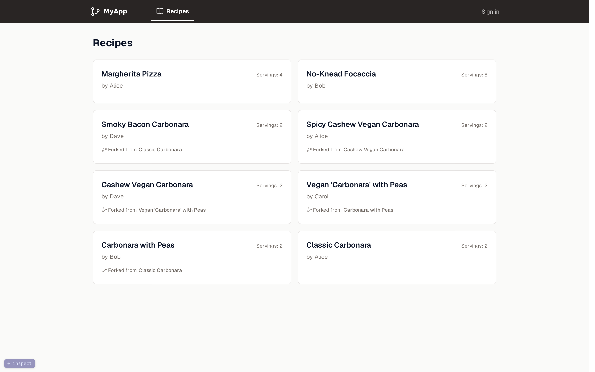

# What We Are Building, and Why

This is a book about building a real web application (a multi-tenant SaaS) in Clojure and Datomic, server-rendered, from an empty directory to automated deployment. It commits to that one application for the whole book and builds it the way it would actually be built if correctness, security, and the daily experience of working on it all mattered. That commitment rules out both the toy example and the survey of every library that exists. Three things frame everything that follows: what the application is, the principle that settles every technical question along the way, and the shape each chapter takes.

## The application: a recipe versioning site

The running example is a recipe versioning site -- think "Git for recipes." Anyone can browse recipes; a signed-in user can fork one, tweak its ingredients and steps, and publish their own version. The app shows the diff between any two versions, the lineage of a recipe ("this carbonara descends from four earlier versions") and a point-in-time view of how a recipe looked at any moment in its history. It is multi-tenant in the plainest form the term admits: the tenant is the user. One schema, one database, isolation by ownership, enforced at the single point where every read and write already passes. [The progressive-enhancement chapter](20-progressive-enhancement.md) builds that enforcement and argues where in the stack it belongs. If your tenant is an organization rather than a person, the owner ref changes; the machinery does not.

*The finished application's recipe index -- every card, badge, and fork lineage rendered on the server. The small `inspect` pill in the bottom-left corner is not part of the product: the capture was made in the development environment, and the pill toggles the source inspector that [chapter 16](16-inspector.md) builds.*

The domain was chosen for its shape rather than its novelty, because two of its properties make it an honest test of the stack. The first is that it is *history-shaped*. Versions, forks, diffs, and "as of last Tuesday" would be bolt-on features in most domains; here they *are* the product. That makes it a natural fit for Datomic, a database that treats time as a first-class dimension and never overwrites the past, so that edit history falls out of `d/history` and point-in-time reads out of `d/as-of` rather than out of a hand-rolled audit table. The second is that it is *content-heavy and read-mostly*: recipes are mostly text, mostly read, and they benefit from being indexable and fast to first paint -- which is the workload server-side rendering is best at, and precisely the case where reaching for a single-page-app framework would be the wrong instinct.

Your own domain will differ (invoicing, scheduling, analytics), but the spine carries over directly: a server that renders HTML, a database that remembers everything, passwordless authentication, internationalization, a hardened asset pipeline, and audited deployment.

## The principle: the best build, not the easiest explanation

Every choice in this book is made to produce the best server-rendered web application we know how to build -- the most correct, the most secure, the fastest, and the most pleasant to maintain -- and that is the only tiebreaker. Where a simpler approach would be easier to *explain* but would leave you with a worse application, the harder approach wins, and the burden of making it clear falls on the prose.

This is the opposite of how most tutorials are written. A tutorial optimizes for the reader's first twenty minutes: it picks whatever is quickest to demonstrate, defers the hard parts, and quietly ships decisions you would have to undo in production. This book optimizes for the application you are holding at the end. Sometimes that means a chapter is harder than it would strictly need to be to "work on my machine" -- because that was never the goal.

That principle has consequences that recur throughout. Strict compilation goes on from the first day, and when the Content-Security-Policy arrives with the asset pipeline it arrives already strict (forbidding unauthorized inline scripts outright), and neither is ever relaxed for convenience. HTML is rendered on the server and progressively enhanced rather than assembled by a client framework, and where client behavior is needed it is a few small ES modules under a policy that forbids `eval`. Datomic's immutability is treated as a feature to exploit, not a constraint to work around. And the developer experience itself -- live reload, and a source inspector that maps rendered HTML back to the Clojure that produced it -- is built as real infrastructure, and built early, so that it pays off across every chapter that follows. That last commitment even shapes the order of the book: developer affordances arrive as early as their dependencies allow, so that you build the rest of the application with the tools already in hand.

One of those consequences (rendering on the server rather than shipping a client framework) is an architectural decision in its own right, and the next chapter makes it: where the conviction that *the server is the authority* comes from, the gains and the price of holding it, and the situations where the opposite choice would be the sound one.

## How each chapter is built: problem, options, choice

Every chapter takes on one problem -- a feature, a piece of infrastructure, a single decision -- and every chapter is built the same way, because that structure *is* the argument the book is making. It opens with the problem, stated before any code: what we are trying to do, and why it matters. It then weighs the options actually on the table, including the naive one you would reach for first and the one a different engineer would defend, each with its genuine trade-offs rather than a strawman. And it closes with the choice: which option we take, what it costs, and the reasoning that makes that cost worth paying.

This is deliberate, because a decision you can see the alternatives behind is a decision you can *re-make* when your constraints differ from ours. If you are building on a different database, or you must support a client-heavy UI, or your security posture is stricter or looser than ours, the chapter that shows its work tells you exactly which assumption to revisit, whereas a chapter that shows only the final answer leaves you guessing. So "we considered X but chose Y" is the most reusable part of a chapter.

## The journey

After the next chapter sets the architectural position, the book proceeds in roughly eleven movements, each assuming the ones before it. It begins with the foundations: a reproducible development environment, strict compilation that catches reflection and boxed math from the first commit, a first Ring, http-kit, and reitit web server, and, immediately, live reload, so the feedback loop is tight before there is much to build.

From there it turns to data: a single swappable clock, a Datomic schema and the `java.time` bridge, the recipe-versioning domain itself (where version history and point-in-time reads fall out of `d/history` and `d/as-of` instead of tables you maintain by hand, and forks and diffs are modeled on top of them), the provenance that annotates every write's transaction with its author and, when offered, a note, and the test harness that every later chapter inherits.

The third movement puts pages on the screen and sharpens the loop that builds them. The pages: internationalization wired in from the start, styling with Tailwind, server-rendered HTML with Hiccup and the escaping renderer that is our first line of defense against cross-site scripting, and the morph dispatcher that turns full page loads into in-place navigation. The loop: the developer tooling the principle section promised. A source inspector turns a click into a jump to the Clojure that rendered it; a construction view records a request's whole execution and projects it onto the page it produced; and live reload grows into a per-edit delivery matrix that morphs the live DOM for view edits, hot-swaps CSS, and falls back to a full reload only where one is genuinely required.

The fourth movement adds the features and proves them: a progressive-enhancement layer that keeps every feature working without JavaScript, forms whose validation is data and whose errors re-render in place, a live preview rendered speculatively through `d/with`, full-text search from the index the schema already carried, passwordless authentication with HMAC-signed, single-use magic links, the full email login flow with sessions and a terms gate, an activity feed read straight from the transaction log, end-to-end tests with Playwright driving those flows in a real browser, and an admin dashboard.

The fifth is production hardening, all the way to a running box: the asset pipeline, with content hashing, Subresource Integrity, an import map, and a strict Content-Security-Policy; pages made legible to machines (Open Graph, schema.org structured data, and a sitemap read straight from the database) and cheap to revisit, with conditional GET validated by Datomic's basis-t; the server render path measured with criterium and a flamegraph rather than assumed; Lighthouse scores engineered toward 100, with accessibility and best-practices gated at 100 in CI and performance held to a 95 floor against measurement jitter; CI/CD with Forgejo Actions, Podman, and automated deployment; and then the box itself, assembled and proven (PostgreSQL behind Datomic's transactor, the systemd units, automatic TLS), closing the deploy window to nothing by running two instances of the same jar. The sixth movement operates what the first five built, under the rule that a claim is drilled or not made: metrics from the JVM and the peer itself, alerting assembled from systemd and the mail relay the app already requires, backups restored and verified rather than assumed, the right to be forgotten exercised with Datomic's excision against real storage, and an audit that prices the road beyond one box instead of promising it. The seventh defends it: a security-event trail feeding a fail2ban that bans a brute-force at the packet level, live containment levers that need no redeploy -- ban an IP, ban a user, rotate a key through a grace window -- and a default-deny firewall, a real dependency-CVE gate, and unattended OS patching keeping the attack surface small and current. The eighth returns to the app with the whole stack in view, for the two collaboration features the single-page world claims as its own: asynchronous (a fork's changes proposed back and resolved by a three-way merge whose common ancestor is a read, not a reconstruction) and real-time (a live viewer count pushed over Server-Sent Events, proving server-rendering is not the opposite of live). The ninth turns the lens on the safety machinery itself -- the backups, alerts, health checks, and reaper the earlier movements built -- on the discovery that it was the one system nothing watched, and asks of each guard not merely whether it works but what proves it still works and what happens when it fails. The tenth ties off the last loose thread with the first *domain*-shaped background job: a durable job queue whose storage is Datomic rather than a broker, proving one final time that the infrastructure you already run does the work the reflex would buy a second system for. The eleventh bounds the last unbounded read — the catalog browse — with keyset pagination that seeks the title index the schema already carries, one page at a time. The twelfth gives the app its first user files — recipe photos — on a content-addressed store on the box's own disk rather than a bucket, normalized on ingest and served straight from disk, and prices the exact rung on the scaling ladder where a managed object store finally earns its place instead of being the reflex.

## What you should already know

The book assumes you can read basic Clojure -- roughly the level of *Clojure for the Brave and True*: functions, the core data structures, `let`, `->` and `->>`, basic protocols and macros, and enough Java interop not to flinch at `(.method obj)`. It assumes basic HTML, CSS, and JavaScript. It also assumes you are at home with the infrastructure the application runs on (Docker and Docker Compose, TLS and certificates, and a reverse proxy), which the book uses as tools you already own rather than topics it teaches from scratch; the environment chapter leans on all three before the application itself appears. It does *not* assume you have built web applications in Clojure before; Ring, reitit, Datomic, Hiccup, the `java.time` bridge, content-hashed assets, import maps, DOM morphing, the Content-Security-Policy, and the deployment tooling are all introduced as we reach them, each as its own problem, with its own options and its own justified choice.

## How hard this gets, and how to read the hard parts

A word on difficulty, since the best-engineering stance has a cost the reader pays too: this book pushes harder than a tutorial would, on purpose, and it is worth knowing where so you can slow down rather than bounce off. Most chapters stay within reach of the prerequisites above, but a few places spike, and the earliest is not a Clojure problem at all: the environment chapter is dense in *infrastructure* (Docker networking, three separate certificate trust stores, and container capabilities), and it lands before the application does. If that ops material is unfamiliar, lean on the companion repo's working setup and keep moving instead of mastering it in place. Three more spikes are Clojure-side. The live-reload chapter leans on raw `java.nio` file-watching interop that is fiddlier than everyday Clojure. The Datomic chapter asks you to think in Datalog's entity-attribute-value facts, a different shape from SQL. And the construction-view cluster -- the source inspector and the ClojureStorm-based runtime call/data overlay -- is the most advanced machinery in the book, deep enough that it earns three chapters. One spike, though, is not a chapter but a whole *movement*: the final third turns from building the application to *operating* it (systemd units, the reverse proxy, fail2ban, a firewall, backup and excision drills, a 3am runbook), and leans on the operator competencies the prerequisites named. The reader this book imagines is the full-stack owner who is both the application's builder and its operator; wherever you are more one than the other, that is the ground to slow down on. That difficulty is never gratuitous: where a chapter gets hard it is because the problem is, and the prose walks the parts that do the real work in full rather than waving at them. Two things make the climb easier. The companion repository is the finished, running application, so anything the text explains you can also read, run, and step through in place -- when a listing gets dense, open it there and watch it work. And the hardest chapters are built to be read twice: the argument and the shape land on the first pass and the implementation detail on the second, so you can take the idea and keep moving, then come back for the mechanics when you want them.

The place to begin, then, is not with code at all, but with the one decision the rest of the book rests on -- and that is the next chapter.
