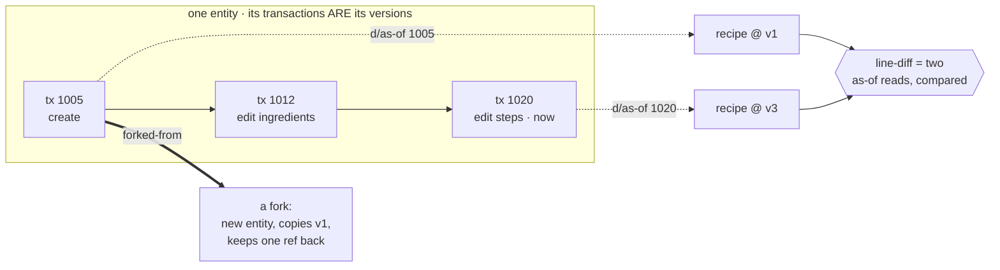
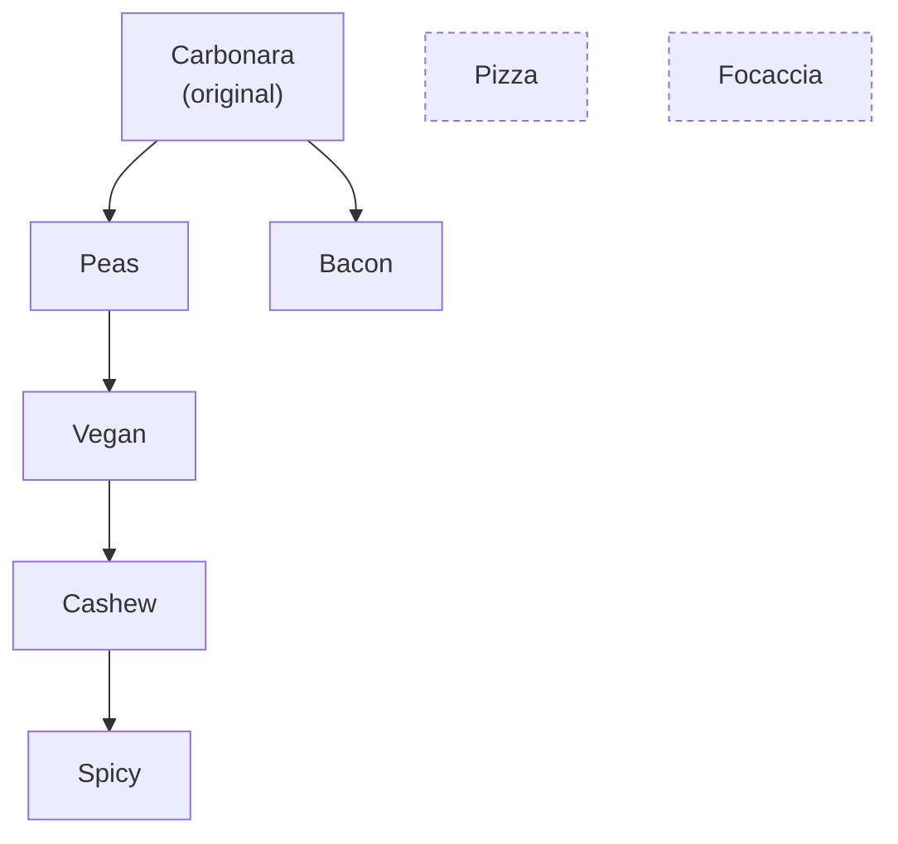

# The Recipe Domain: Versions, Diffs, and Forks from Datomic's History

The previous chapter ended on a promise. It chose Datomic over PostgreSQL on the strength of one claim -- that for an application whose subject is the history of its data, immutability is not a nicety but the correct model -- and it left that claim mostly unspent. The schema was the user account; the time-travel reads it kept mentioning never appeared. This chapter spends the claim. It builds the recipe domain, the part of the application the [primer](01-primer.md) described as "Git for recipes": browse a recipe, fork someone else's, edit your copy, and see the diff between any two versions, the lineage back to the original, and the recipe exactly as it stood at any past moment.


What makes this domain worth its place in the book is that none of those features is a feature you build. Versions are not a `recipe_versions` table you write to on every edit; they are the transactions that already happened. A diff is not a stored delta; it is two reads of the past compared. Lineage is not a closure table; it is one reference walked. The work of this chapter is mostly the work of *not* building things -- of recognizing that Datomic has already recorded what a relational schema would make you record by hand, and writing the thin reads that ask it back. That recognition is the whole argument for the database, made concrete.

## The schema

The schema chapter built `user-schema` and noted that the same file would grow a `recipe-schema` as the domain arrived. Here it is:

```clojure
(def recipe-schema
  "Schema for the recipe-versioning domain — \"Git for recipes\"."
  [{:db/ident :recipe/id
    :db/valueType :db.type/uuid
    :db/unique :db.unique/identity
    :db/cardinality :db.cardinality/one
    :db/doc "Unique recipe ID (stable across edits; a fork gets a new one)"}
   {:db/ident :recipe/user
    :db/valueType :db.type/ref
    :db/cardinality :db.cardinality/one
    :db/doc "Owning user. Only the owner may edit or delete (tenant isolation)."}
   {:db/ident :recipe/title
    :db/valueType :db.type/string
    :db/cardinality :db.cardinality/one
    :db/fulltext true
    :db/doc "Recipe title"}
   {:db/ident :recipe/description
    :db/valueType :db.type/string
    :db/cardinality :db.cardinality/one
    :db/doc "Short description / headnote, rendered as Markdown"}
   {:db/ident :recipe/servings
    :db/valueType :db.type/long
    :db/cardinality :db.cardinality/one
    :db/doc "Number of servings the quantities are written for"}
   {:db/ident :recipe/ingredients
    :db/valueType :db.type/string
    :db/cardinality :db.cardinality/one
    :db/doc "Ingredients, one per line (newline-separated so versions line-diff)"}
   {:db/ident :recipe/steps
    :db/valueType :db.type/string
    :db/cardinality :db.cardinality/one
    :db/doc "Method, one step per line (newline-separated so versions line-diff)"}
   {:db/ident :recipe/forked-from
    :db/valueType :db.type/ref
    :db/cardinality :db.cardinality/one
    :db/doc "The recipe this one was forked from. Absent on originals."}
   {:db/ident :recipe/position
    :db/valueType :db.type/long
    :db/cardinality :db.cardinality/one
    :db/doc "Display order within the owner's dashboard. Deliberately excluded
             from the version timeline so reordering is not a content change."}
   {:db/ident :recipe/created-at
    :db/valueType :db.type/instant
    :db/cardinality :db.cardinality/one
    :db/doc "When this recipe (this fork) was first created"}
   {:db/ident :recipe/updated-at
    :db/valueType :db.type/instant
    :db/cardinality :db.cardinality/one
    :db/doc "When this recipe was last edited"}])

(def schema
  "The full schema, transacted on database creation."
  (vec (concat user-schema recipe-schema)))
```

Everything the chapter builds is already decided in this listing, and the decisions are worth naming before the code that depends on them. (Two things to flag: the repository carries longer docstrings on `recipe-schema`, `schema`, and `:recipe/position` than the listing shows; and the shipped schema has since grown by accretion -- `:recipe/title` gains a `:db/index true` for keyset pagination in [the pagination chapter](48-pagination.md), and a `:recipe/image` ref is appended for photos in [the file-storage chapter](49-file-storage.md). The attribute definitions this chapter builds on are otherwise as shown.)

A recipe is **one entity**. There is no separate version record. When the owner edits the ingredients, that is an ordinary transaction asserting a new value of `:recipe/ingredients` on the same entity -- and because Datomic never overwrites, the prior value is still a fact, still queryable, tagged with the transaction that retired it. The version history is therefore not something the schema provides; it is something the schema *cannot avoid*. The same property that would be an audit burden in a mutable store -- "we keep everything" -- is here the feature, free.

That is the whole idea in one picture: a version is not a row you write, it is a transaction that already happened, and every feature this chapter builds is a *read* of the timeline the edits leave behind.



*Nothing here is stored twice. "Version 1" is `d/as-of` the transaction that created it; a diff is two of those reads compared; a fork is a new entity that copied one past version and kept a `:recipe/forked-from` ref. The database did the remembering; the domain only asks.*

`:recipe/forked-from` is a **self-reference**: a ref attribute on a recipe pointing at another recipe. A fork is a brand-new entity with a fresh `:recipe/id`, carrying a copy of the source's content plus this one ref back to where it came from. Following the ref upward, recipe to parent to grandparent, is the lineage. Querying for entities that point *at* a given recipe is the set of its direct forks. The fork graph is a single attribute; the traversals are two short queries.

`:recipe/ingredients` and `:recipe/steps` are **newline-separated text**, not a collection of ingredient entities. This looks like the lazy choice and is in fact the one the diff feature stands on: storing them as line-delimited strings is what lets a version-to-version comparison be a *line diff*, the same kind of diff and the same `+`/`-` display a programmer already reads fluently from `git diff`. Modeling each ingredient as its own entity would buy structured querying the application never needs and cost the very diff it depends on.

The odd attribute out is `:recipe/position`, the owner's manual dashboard ordering. It is on the entity but it is emphatically *not* part of the content: dragging a card to the top of your dashboard must not register as a new version with an empty diff. Keeping it off the timeline is a single decision made in the domain code, below, and the dashboard-reorder mechanism that writes it belongs to the [progressive-enhancement chapter](20-progressive-enhancement.md), where the no-JavaScript reorder UI is built. Here it is enough to know the attribute exists and that the version machinery is written to ignore it.

## Reads

Everything the domain reads goes through one pull pattern, so a recipe always arrives shaped the same way -- its scalar fields, its owner, and (if it is a fork) a thumbnail of its parent:

```clojure
(def pull-pattern
  [:db/id :recipe/id :recipe/title :recipe/description :recipe/servings
   :recipe/ingredients :recipe/steps :recipe/position
   :recipe/created-at :recipe/updated-at
   {:recipe/user [:db/id :user/email :user/display-name]}
   {:recipe/forked-from [:recipe/id :recipe/title {:recipe/user [:user/display-name]}]}])

(defn recipe-by-id
  "Pull the current state of the recipe with `:recipe/id` = `id` (a UUID), or nil."
  [db id]
  (when id
    (when-let [eid (d/entid db [:recipe/id id])]
      (db/pull* db pull-pattern eid))))
```

`recipe-by-id` resolves the entity id before pulling, rather than pulling on the lookup ref directly, for one specific reason: a pull on a lookup ref that matches nothing returns `{:db/id nil}` -- because this pattern requests `:db/id`; without it the pull would be a plain `nil` -- a truthy map that has to be guarded against downstream. Resolving the id first means a missing or retracted recipe returns a plain `nil`, which `when-let` and every caller already handles. It is a small thing that prevents a `{:db/id nil}` from leaking into a view and rendering as a blank recipe page. Note the pull goes through `db/pull*`, the wrapper from the [Datomic chapter](08-datomic.md) that converts `java.util.Date` back to `java.time.Instant` on the way out, so the domain never sees a `Date`.

The browse and dashboard lists are the same pull mapped over a query, and differ only in their sort. `all-recipes` returns everything most-recently-updated first. `recipes-by-user` returns one owner's recipes in dashboard order, and its `dashboard-order` comparator encodes one real rule: recipes with an explicit `:recipe/position` sort first, ascending, and recipes without one sort after them, most recently updated first (the comparator does not assume the attribute is present). The repository has both functions in full; the reads that *are* the point are the temporal ones.

Both are also unbounded, which belongs in the same breath as the version-history cost below: each loads *every* matching recipe through the pull pattern and sorts the whole set in memory, with no `:limit` and no pagination. For the read-mostly, human-scale catalog this domain models that is the right shape, and the sort has to see every row anyway. The public index is the read that outgrows it first, so [the pagination chapter](48-pagination.md) gives the browse a keyset-paginated `browse-page` -- an `O(page)` seek into the `:recipe/title` index -- while `all-recipes` stays as it is and backs only the sitemap, where the whole catalog is genuinely wanted.

## Versions are transactions

A version of a recipe is a transaction that changed its content. That sentence is the entire design, and the function that realizes it is the keystone of the chapter:

```clojure
(defn version-history
  "Every version of recipe `id`, oldest first, reconstructed from Datomic history.
  Each entry is `{:tx <tx-eid> :t <basis-t> :instant <Instant>
  :recipe <state as-of that tx>}`. Returns nil if the recipe doesn't exist."
  [db id]
  (when-let [eid (d/entid db [:recipe/id id])]
    (let [h (d/history db)
          txs (->> (d/q '[:find ?tx ?inst
                          :in $ ?e [?a ...]
                          :where
                          ;; Only transactions that asserted a CONTENT attribute
                          ;; count as a version — a position-only reorder does not.
                          [?e ?a _ ?tx true]
                          [?tx :db/txInstant ?inst]]
                        h
                        eid
                        versioned-attrs)
                   ;; Sort by basis-t, not :db/txInstant — two edits in the same
                   ;; millisecond tie on the instant, which would make version
                   ;; order (and "latest") non-deterministic. t is monotonic.
                   (sort-by (fn [[tx _]] (d/tx->t tx))))]
      (mapv
        (fn [[tx inst]]
          {:tx tx
           :t (d/tx->t tx)
           :instant (db/as-instant inst)
           :recipe (db/pull* (d/as-of db tx) pull-pattern eid)})
        txs))))
```

It queries against `(d/history db)`, a view of the database that, unlike the ordinary database value, contains *every* assertion and retraction ever made. The previous chapter introduced facts in three slots -- entity, attribute, value -- and that was the whole shape its queries needed. The full datom carries two more components: the transaction that wrote it, and a flag that is `true` for an assertion and `false` for a retraction. The history view exposes both, and this query pivots on both. `[?e ?a _ ?tx true]` matches a datom on our entity `?e`, for some attribute `?a`, with any value (`_`), asserted (the trailing `true`, as opposed to a retraction) by transaction `?tx`. The `?a` is bound from the outside by `[?a ...]`, the collection-binding form, to `versioned-attrs` -- so the query matches only transactions that touched a *content* attribute:

```clojure
(def ^:private versioned-attrs
  [:recipe/title :recipe/description :recipe/servings
   :recipe/ingredients :recipe/steps :recipe/forked-from])
```

This is where `:recipe/position` earns its exclusion. A dashboard reorder asserts only `:recipe/position`, which is not in the list, so its transaction never matches the pattern and never appears as a version. The timeline stays a record of content changes, and a reorder does not surface as a phantom version whose diff is empty. The list is small, explicit, and the single point of truth for the question "what counts as an edit."

The query asks for `:db/txInstant`, the wall-clock time of each transaction, but it does **not** sort by it; it sorts by `(d/tx->t tx)`, the transaction's basis-t. The reason is that two edits made in the same millisecond carry the same instant, and sorting on a value with ties makes "which version is newest" non-deterministic from one query to the next. The basis-t is Datomic's monotonic transaction counter; it never ties, so it gives a total, stable order. Wall-clock time is what we *show* the user; basis-t is what we *sort* and *address* by. And the per-version state itself comes from `(d/as-of db tx)` -- the database as it stood as of that transaction -- pulled with the same pattern as a live read. `d/as-of` is the second half of the promise from the previous chapter, finally called: a point-in-time database value you query just like the present one.

The reconstruction carries a cost, because "thin" describes the code, not the work. `version-history` runs one query over the recipe's history and then a full `as-of` pull per version, owner and parent thumbnail included, so the history page is linear in the recipe's edit count, and nothing in the chain paginates. For this domain that is the right shape: a recipe accumulates edits at human speed, each pull is one recipe plus its owner and parent thumbnails, and the page that renders the result shows every version anyway. A domain whose entities collect thousands of revisions would want a bounded query and a paginated page before it wanted anything else here.

Addressing a single past state directly is its own small function:

```clojure
(defn version-as-of
  "The state of recipe `id` as of basis point `t` (a basis-t, tx-eid, or Date)."
  [db id t]
  (when-let [eid (d/entid db [:recipe/id id])]
    (db/pull* (d/as-of db t) pull-pattern eid)))
```

That `t` is the same basis-t `version-history` exposed on each entry, which means a URL can carry it. The [progressive-enhancement chapter](20-progressive-enhancement.md) serves `/recipes/:id/at/:t` straight from this function and, because a past state is immutable by construction, caches it for a year -- the basis-t in the path *is* the version, an address that can never go stale. The addressability the [positioning chapter](02-positioning.md) argued for in the abstract is, here, a recipe id plus an integer.

## Diffs are two reads compared

With any two versions reconstructable, a diff between them is a pure function of two pulled maps. The scalar fields compare directly; the two list fields -- ingredients and steps -- get a line diff, which is where the newline-separated storage pays off:

```clojure
(defn line-diff
  "A git-style line diff of two newline-separated strings.

  Returns a vector of `{:op :ctx|:add|:del :text <line>}` in display order,
  from Myers' O(ND) shortest edit script: shared lines are `:ctx`, lines
  only in `new-text` are `:add`, lines only in `old-text` are `:del`.
  Pure data → data."
  [old-text new-text]
  ...)
```

The body is Myers' O(ND) difference algorithm -- the greedy edit-distance search at the core of what `git diff` itself runs. The choice matters, and it is where "best engineering over teachability" earns its keep: a textbook longest-common-subsequence table is easier to explain, but it is O(n·m) in *both* time and heap, so on a public, cacheable endpoint two large versions are a quadratic blow-up that OOMs the whole box -- which the first cut then papered over with a line-count cap and an all-delete/all-add fallback bolted on to contain it. Myers costs O(n·d), where *d* is the number of lines that actually changed: a one-line edit to a thousand-line recipe is linear, not quadratic, so the cap and the fallback are simply not needed for any real edit, and the one bound that remains -- a ceiling on the edit distance itself -- fires only for a pair that shares almost nothing, where a line-level diff would be visual noise anyway. It is the densest function in the namespace, and the repository has it in full; the shape above -- and the data it returns -- is what matters here. One implementation note connects back to an earlier chapter: the search runs over a primitive `long`-array frontier with primitive-`long` arithmetic throughout, because the [strict build](04-build-hardening.md) fails on boxed math, and the obvious idiomatic version boxes every index. The constraint set in chapter 4 reaches all the way into a diff algorithm, which is the point of setting it on the first day rather than the three-hundredth.

`line-diff` returns plain data -- a vector of `{:op :add :text "sugar"}` maps -- so the view layer renders a diff by mapping over it, and a test asserts on it without parsing rendered HTML. The field-level `diff` wraps it together with the scalar comparisons into one map describing everything that changed between two recipe states, carrying a top-level `:changed?` the caller can branch on. It, too, is pure data in and pure data out, with no database handle anywhere in sight -- the temporal reads happened upstream, and the comparison is arithmetic.

## Lineage and forks

One `:recipe/forked-from` ref per entity is the entire fork graph; both traversals the app needs are just that ref read in the two directions. The seed data (below) is shaped to exercise both -- a chain four deep that crosses all four users, and a root with a second child:



*Upward, `lineage` walks `forked-from` parent to parent to the root original (Spicy → Cashew → Vegan → Peas → Carbonara). Downward, "forks of" is the set of entities whose `forked-from` points at you (Carbonara has two: Peas and Bacon). Pizza and Focaccia are standalones -- no ancestor, no forks -- because "an original with no children" is a state the UI has to render too.*

A fork is the content of a recipe copied onto a new entity that remembers its source:

```clojure
(defn fork!
  "Fork the recipe `source-id` (any owner's) into a new recipe owned by `user-eid`.
  Copies the current fields and records `:recipe/forked-from`."
  [conn user-eid source-id]
  (let [db (d/db conn)
        src (recipe-by-id db source-id)
        src-eid (d/entid db [:recipe/id source-id])]
    (when src
      (create! conn user-eid
               {:title (:recipe/title src)
                :description (:recipe/description src)
                :servings (:recipe/servings src)
                :ingredients (:recipe/ingredients src)
                :steps (:recipe/steps src)
                :forked-from-eid src-eid}))))
```

`source-id` is any recipe at all, since forking someone else's recipe is the entire social premise, and `fork!` takes no ownership check. The new recipe is a normal `create!` with one extra field. `create!` itself is elided here (it is the plain transaction described below, in the repository in full), but the one line of it that matters to forking is a `cond->`: when the `:forked-from-eid` option is present, it assocs `:recipe/forked-from` onto the transaction map. That is how the plain option key in the listing above becomes the namespaced ref in the database, and why an original simply lacks the attribute. From that single ref, both directions of the fork graph fall out. Upward, `lineage` walks parent to parent until it reaches an original:

```clojure
(defn lineage
  "Ancestors of recipe `id`, immediate parent first, up to the root original.
  Empty vector for an original recipe. Spans owners."
  [db id]
  (loop [cur (recipe-by-id db id)
         acc []]
    (if-let [parent-id (get-in cur [:recipe/forked-from :recipe/id])]
      (let [parent (recipe-by-id db parent-id)]
        (if (or (nil? parent) (some #(= (:recipe/id parent) (:recipe/id %)) acc))
          acc
          (recur parent (conj acc parent))))
      acc)))
```

The cycle guard -- stop if the parent is already in the accumulator -- cannot trigger through the UI, since a fork always points at a recipe that existed before it. It is there because the lineage is reconstructed from a stored reference, and a hand-written transaction could in principle form a loop; a read that walks references should not be the thing that hangs the request if the data is ever malformed. Downward, `forks` is a one-line query for the entities whose `:recipe/forked-from` points at a given recipe. The fork graph is navigable in both directions and was never built as a graph -- it is one ref attribute, read two ways.

## Mutations, and where ownership lives

Creating a recipe is a plain transaction; the only subtlety is computing its initial dashboard position so a new recipe appends to the end of the owner's list. Editing and deleting are owner-gated:

```clojure
(defn update!
  "Apply `changes` (a subset of the `:recipe/*` content keys) to recipe `id`,
  if owned by `user-eid`. Bumps `:recipe/updated-at`."
  [conn user-eid id changes]
  (let [db (d/db conn)]
    (when-let [eid (db/entid-owned db user-eid [:recipe/id id])]
      @(db/transact* conn
         [(merge {:db/id eid :recipe/updated-at (time/now)}
                 (select-keys changes
                   [:recipe/title :recipe/description :recipe/servings
                    :recipe/ingredients :recipe/steps]))])
      true)))
```

The gate is `db/entid-owned`: resolve the recipe's entity id, but only if it belongs to `user-eid`, and otherwise return `nil` so the whole `update!` short-circuits to `nil` and changes nothing. This is the tenant-isolation layer the [Datomic chapter](08-datomic.md) flagged as a coming addition to `myapp.db.core`; it is built in full in the [progressive-enhancement chapter](20-progressive-enhancement.md), alongside the other `*-owned` helpers and the question of where in the stack ownership should be enforced. For this chapter it is enough that a non-owner's edit resolves no entity and is silently refused, which the tests below pin down.

`delete!` follows the same shape with a `:db/retractEntity`, and what that does to the fork graph is a decision, not a side effect. `:db/retractEntity` retracts every datom that mentions the entity, inbound references included, so each fork's `:recipe/forked-from` is retracted in the same transaction. A deleted recipe's forks keep their copied content but lose their provenance: in the current database a fork of a deleted recipe is indistinguishable from an original, `lineage` comes back empty, and it stops counting as a fork. The alternative was available -- retract only the recipe's own attributes and leave the inbound refs standing -- and it was declined. That version preserves each fork's claim to be a fork, but the claim now points at an entity stripped of content, and every consumer of the ref inherits the question of what a reference to nothing should mean: the parent thumbnail in `pull-pattern`, the walk in `lineage`, every view that renders either. Retracting the refs keeps the present view self-consistent, and it costs less than it appears to, because the provenance is only demoted: an `as-of` read at any pre-delete basis still shows the ref and the parent together, so past views stay whole. It also leaves the missing-parent check in `lineage` as a guard against malformed data, in the same class as its cycle guard, rather than something a delete ever exercises.

> **What `delete!` cannot do -- the price of immutable history.** The previous chapter sold "nothing is ever truly deleted" as the feature it is; here is where the same sentence is a liability, and the book owes it a price. `delete!` changes what the present shows, not what the database holds: the full content of a deleted recipe -- every title, every ingredient list, every version -- remains readable through `d/history` and `d/as-of`, indefinitely, by any code with a connection. For user-authored content, that collides with a legal reality: a user who invokes a right to erasure (the GDPR's is the named form) is asking about history, and a retraction does not touch history. Datomic Pro's answer is **excision**: transact `:db/excise` against an entity and its datoms are removed for good: irreversible, deliberately heavyweight, and meant for compliance work rather than routine deletes. Datomic Cloud does not offer it at all. This build stops at `delete!` because excision is an operator's procedure, not an application feature; wiring the rarest and most destructive write in the system into a request handler would be a category error. But an application holding personal data on this schema ships with excision in its runbook, or it cannot honor an erasure request. The storage bill belongs on the same line: history is append-only and grows with every edit and every reorder, forever, and `:db/noHistory` is the per-attribute opt-out for high-churn values nobody will ever time-travel to. The previous chapter itemized what this design costs the reader on PostgreSQL; these are the line items on the Datomic side of the bill.

Note also what `update!` does *not* touch: `:recipe/position`. Reordering goes through its own path, so an edit bumps `:recipe/updated-at` and creates a version, while a reorder does neither.

## The seed: demo data as a designed fixture

The domain is now complete enough to deserve better development data than a row named "Test" -- and `dev/seed.clj` is written as if that mattered, because it does. Seed data is usually an afterthought: random rows, lorem ipsum, whatever makes the list page non-empty. Ours is a *fixture with a shape*, chosen feature by feature against everything this chapter just built:

```
Seeded recipes:
  Classic Carbonara (alice, 3 versions)
  Carbonara with Peas (bob)
  Vegan Carbonara (carol)
  Cashew Vegan Carbonara (dave)
  Spicy Cashew Vegan Carbonara (alice) — descends from 4
  Smoky Bacon Carbonara (dave)
  Margherita Pizza (alice, 2 versions)
  No-Knead Focaccia (bob)
```

Each line is there to exercise something. The root carbonara carries three versions of hand-built edit history, so the timeline and the diff view always have real changes to show -- an ingredient added, a description reworded -- not synthetic noise. The fork chain runs four deep and crosses all four users (`carbonara → peas → vegan → cashew → spicy`), so `lineage` walks a real ancestry, the "forked from" provenance crosses ownership boundaries, and the deepest leaf descends from four ancestors. The bacon fork gives the root a *second* child, so a fork list is a list. And the pizza and focaccia are standalones, because "no ancestors, no forks" is a state the UI renders too. Even the content is real cooking, line-grained and lightly markdowned: when the diff is a line diff, demo edits have to be *legible* edits, the kind a reader can check by eye in a screenshot.

The construction discipline matters as much as the shape: the seed goes through `create!`, `update!`, and `fork!` -- the domain API, never a raw transact. That buys two things. The seed cannot manufacture a state the domain forbids, so it doubles as a standing integration test that runs at every fresh dev boot; when a domain rule tightens, the seed breaks loudly, at the desk of whoever tightened it. And everything the write path stamps onto real writes -- timestamps, dashboard positions, and from [the next chapter](10-provenance.md) on, the transaction's author and one honest commit note -- lands on the demo data identically, because it *is* real writes, just scripted.

`seed-if-empty!` runs at dev startup and seeds only a virgin database; `seed!` itself is additive, so re-running it piles up duplicates by design; the workflow is `(fresh!)` (reset, then seed), not idempotent reconciliation, which would be machinery in service of avoiding one REPL call. The dividend compounds for the rest of the book: [search](23-search.md) ranks against six carbonara variants, [the activity feed](26-activity.md) windows over cross-user events, [the benchmark chapter](32-server-path-measured.md) asks this graph for its deepest lineage and measures that -- one fixture, designed once, put to work everywhere.

## The proof

None of this is asserted; it is tested, and the tests are the most direct statement of what the domain guarantees. They build a recipe from nothing, edit it, and read its history straight back:

```clojure
(deftest edits-create-versions
  (let [u (mk-user! "a@x.lan")
        id (recipe/create! h/*conn* u {:title "Soup" :ingredients "water"})]
    (recipe/update! h/*conn* u id {:recipe/ingredients "water\nsalt"})
    (recipe/update! h/*conn* u id {:recipe/ingredients "water\nsalt\npepper"})
    (let [versions (recipe/version-history (d/db h/*conn*) id)]
      (is (= 3 (count versions)) "create + 2 edits = 3 versions")
      (testing "oldest version reconstructs the original via d/as-of"
        (is (= "water" (:recipe/ingredients (:recipe (first versions))))))
      (testing "newest version has the latest content"
        (is (= "water\nsalt\npepper" (:recipe/ingredients (:recipe (last versions))))))
      (testing "version-as-of by basis-t returns that point's state"
        (let [t (:t (first versions))]
          (is (= "water" (:recipe/ingredients (recipe/version-as-of (d/db h/*conn*) id t)))))))))
```

Three transactions, three versions, and the first version still says `"water"` though the recipe now says `"water\nsalt\npepper"` -- a past state read out of `d/as-of`, intact, with no version table behind it. The diff test makes the same point about comparison: it edits a cake from eight servings to twelve and adds sugar, then asserts that `diff` reports the servings change with both old and new values and that `"sugar"` appears in the ingredients diff as an `:add`. The fork tests build a chain four deep and check that `lineage` returns the three ancestors parent-first to the root, that an original has no ancestors, and that a fork is owned by the forking user while recording its provenance back to a recipe it does not own. And the isolation tests confirm the gate: a non-owner's `update!` and `delete!` both return `nil` and leave the recipe untouched, while the owner's succeed. Every one of these runs against the in-memory database from the [Datomic chapter](08-datomic.md)'s fixture, in milliseconds, with no setup beyond transacting a user to own the recipes.

What the chapter built is small -- a schema, a pull pattern, a handful of reads, two mutations, a diff -- and most of it is reads rather than machinery. That is the shape of the argument. A recipe-versioning product in a mutable store is a version table, a trigger or an application-level write on every edit to populate it, a soft-delete column, a query language for "as of" that the database does not speak, and the standing risk that the audit trail and the live row disagree. Here the audit trail *is* the database, the "as of" is an API call, and the two cannot disagree because there is only one of them. That is what it means to treat immutability as a feature to exploit rather than a constraint to work around: the history you would otherwise build by hand is the history you were storing all along, and the work is learning to ask for it.
