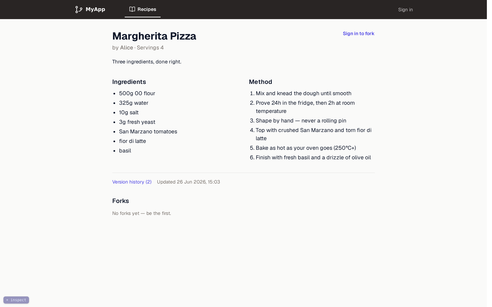

# Server-Rendered HTML with Hiccup: Views, Layouts, and Escaping



*A single recipe page, assembled entirely on the server: Hiccup views rendered through the layout system this chapter builds.*

In the previous chapters we set up our Ring server and routing with Reitit, a live-reload workflow, a Datomic schema, internationalization, and Tailwind styling. But we glossed over how pages actually get rendered. In this chapter we build the entire server-side view layer: HTML generation with Hiccup, a layout system that shares structure across pages, navigation components, the output-escaping that is our primary defense against cross-site scripting, and Markdown rendering. The progressive-enhancement layer that makes navigation feel instant -- the client dispatcher -- is involved enough to earn [its own chapter](15-morph-dispatcher.md) next; here we build the views it enhances. (The login and session machinery the layouts hint at, magic-link authentication, comes later, in the authentication chapters; here we just render the views it will plug into.)

## Why server-rendered HTML

[The positioning chapter](02-positioning.md) made the architectural case for server authority. This chapter is where that decision lands in code, and it means three concrete things for the view layer. Rendering is a function call: the Clojure server already has all the data, so a page is functions over data in one process, with no API layer or serialization boundary in between. The browser receives complete HTML, so there is nothing to hydrate and no client application to boot before the page is usable. And JavaScript stays optional: a small script ([the next chapter](15-morph-dispatcher.md)) upgrades navigation and form submissions into in-place updates, but every page works without it.

Note what none of the three requires: a bundler. The project does acquire build steps -- Tailwind produces the stylesheet ([the Tailwind chapter](13-tailwind-styling.md)), and production content-hashes and minifies assets ([the asset pipeline chapter](29-asset-pipeline.md)) -- but nothing is ever bundled, and no build output is an application the browser must execute before the page works.

## Hiccup 2: HTML as data

[Hiccup](https://github.com/weavejester/hiccup) represents HTML as Clojure data structures. We render with version 2 (`hiccup/hiccup "2.0.0"`), whose `hiccup2.core/html` macro auto-escapes string content by default. That auto-escaping is the foundation of our XSS defense -- more on this in the output-encoding section below.

The core idea is simple. HTML elements become Clojure vectors:

```clojure
;; Hiccup
[:h1 "Hello"]

;; Becomes
;; <h1>Hello</h1>
```

Attributes are maps in the second position:

```clojure
[:a {:href "/dashboard" :class "text-primary"} "Go to dashboard"]
;; <a href="/dashboard" class="text-primary">Go to dashboard</a>
```

CSS classes can use dot syntax for brevity:

```clojure
[:div.mt-4.text-center "Centered text"]
;; <div class="mt-4 text-center">Centered text</div>
```

And since it is just data, you can use all of Clojure: `if`, `for`, `when`, `let`, function composition. There is no template language and no special syntax for conditionals or loops. That is a real design decision with real costs, and its alternatives deserve to be visible behind it.

> **Decision -- why HTML-as-data, not templates?** The alternatives deserve names. **Selmer** brings Django-style string templates to Clojure: views are plain text files with `{{title}}` holes and ``/`` tags, a designer who has never read Clojure can edit them, and HTML from any documentation pastes in unchanged. **Enlive** keeps the views as pure HTML files and expresses the logic separately, as Clojure transformations keyed by CSS-style selectors. Both keep HTML as HTML, and Hiccup's honest costs are the mirror image of that strength: a designer cannot edit a Clojure function, and every snippet you lift from MDN or a component library must be hand-translated into vectors. We pay those costs for two reasons. First, a rendered template is an opaque `String`. Conditionals and loops arrive as a second mini-language embedded in text, and escaping becomes a per-variable convention: Selmer escapes by default, but a `|safe` filter opts out anywhere, and the engine never parses the surrounding HTML, so it cannot know whether a hole lands in element text, an attribute, or a URL. Hiccup's renderer owns every interpolation point structurally, which is the property the escaping section below builds on. Second, and decisive for this book: **data can carry metadata; strings cannot.** [The inspector chapter](16-inspector.md) reads the view namespaces with `tools.reader`, welding `file:line:column` onto every element vector, and that is what makes hover-an-element-and-open-its-source possible; the [construction-view chapters](17-construction-view.md) walk recorded Hiccup values and project them back into the elements they became. Those tools exist *because* a view's output is a Clojure data structure the whole way down. A string template leaves nothing to instrument.

Two rendering rules govern how this data flattens into a document, and the listings that follow lean on them throughout. First, **vectors are elements; seqs are splices.** A vector becomes a tag, while a seq -- what `list`, `for`, and `map` return -- dissolves into its parent's children. That is why the top nav later in this chapter drops a `(list [:span ...] [:form ...])` in where two siblings are needed, and why an `[:svg ...]` holds a `(for [d paths] [:path ...])` directly as a child. Get the two backwards and the renderer refuses to guess: wrap sibling elements in a vector, `[[:li "a"] [:li "b"]]`, and rendering throws `[:li "a"] is not a valid element name`, because a vector's first slot must be a tag.

Second, **`nil` renders as nothing.** A `nil` child vanishes from the output, which is what lets a bare `(when user-email (nav-tab ...))` sit inside markup: the signed-out case is `nil`, and `nil` leaves no trace in the HTML.

We use one namespace from the library for rendering:

```clojure
(require '[hiccup2.core :as h])   ;; escaping html rendering, raw HTML insertion
```

`hiccup2.core/html` renders hiccup with escaping. One detail of its return type matters: it produces not a plain `String` but a `RawString` wrapper, hiccup's marker for "already rendered, escape nothing further." The wrapper is what makes rendered fragments composable (embed one inside another and the outer render passes it through rather than escaping your markup a second time), and it is why the handler helper later in this chapter calls `str` on the result to realize the actual response body. `hiccup2.core/raw` wraps a string we want emitted *verbatim* (no escaping) -- used for the doctype, for markdown-rendered HTML, and for the inline scripts and styles we control. We will see both at work in the base layout.

## The layout system

Every web app has shared structure: the `<head>` tag, stylesheets, scripts, navigation. We handle this with three layout functions that compose together.

### Base layout

The base layout is the HTML5 shell that every page shares:

```clojure
(ns myapp.web.views
  (:require
    [hiccup2.core :as h]
    [myapp.i18n :refer [t]]
    [myapp.web.assets :as assets :refer [defn-asset]]
    [myapp.web.inspector :refer [tag-root]]
    [myapp.web.markdown :as markdown]))

(defn-asset toast-script "myapp/web/toast.js")

(defn- script-tag
  "A <script> for a served asset, with SRI integrity when the manifest provides it
  (prod). `attrs` adds e.g. {:type \"module\"} or {:defer true}."
  [logical attrs]
  (let [url (assets/asset logical)]
    [:script (cond-> (assoc attrs :src url)
               (assets/asset-sri url) (assoc :integrity (assets/asset-sri url)))]))

(defn- base-layout
  "Base HTML5 wrapper. All pages use this — never called directly by page fns."
  [locale & body]
  (h/html
    {:mode :html}
    (h/raw "<!DOCTYPE html>")
    [:html {:lang (name locale)}
     [:head [:meta {:charset "UTF-8"}]
      [:meta {:name "viewport" :content "width=device-width, initial-scale=1.0"}]
      [:meta {:name "description" :content (t locale :meta/description)}]
      [:title "MyApp"]
      [:link {:rel "icon" :type "image/svg+xml" :href "/icon.svg"}]
      [:link {:rel "stylesheet" :href (assets/asset "styles.css")}]
      ;; Import map (must precede any module script) remaps each module's absolute
      ;; import specifier to its hashed URL in prod; identity no-op in dev.
      [:script {:type "importmap"} (h/raw (assets/importmap-json))]
      ;; Idiomorph (classic script) must load before the dispatcher module
      ;; so window.Idiomorph is available when dispatcher.js runs.
      (script-tag "idiomorph" {:defer true})
      (script-tag "js/dispatcher.js" {:type "module"})
      (script-tag "js/controllers.js" {:type "module"})
      (script-tag "js/live-form.js" {:type "module"})
      (script-tag "js/defer-details.js" {:type "module"})
      (script-tag "js/server-preview.js" {:type "module"})
      (script-tag "js/admin-stats.js" {:type "module"})
      ;; ...and one <script> per remaining behavior controller (sortable, confirm,
      ;; tagline); like the dev block below, this is where each one mounts.
      [:style
       (h/raw "@keyframes page-enter{from{opacity:.92;transform:translateY(3px)}to{opacity:1;transform:translateY(0)}}main{animation:page-enter .12s ease-out}")]]
     [:body (tag-root body)
      [:div#toast-container.fixed.bottom-4.right-4.z-50
       {:aria-live "polite" :aria-atomic "true"}]
      (toast-script)
      ;; Dev-only: live-reload client + source inspector + construction-view overlay.
      ;; The requiring-resolve gate makes the whole block absent in production.
      (when
        (try
          (requiring-resolve 'dev-reload/websocket-handler)
          (catch Exception _ nil))
        (list (dev-reload-script) (inspector-script) (trace-overlay-script)))]]))
```

Unpacking that shell:

- **`locale` is threaded everywhere.** Every layout takes it as the first argument, and all user-facing text goes through `(t locale :key)` for i18n. The machinery came in [the i18n chapter](12-i18n.md); the view layer is ready for it from day one.
- **The whole document is built by `h/html`, the *escaping* renderer.** This matters enough that the output-encoding section below is devoted to it. The doctype is the one structural literal we want emitted as-is, so it goes through `(h/raw "<!DOCTYPE html>")`.
- **Assets resolve through `(assets/asset "...")`.** The stylesheet, the module scripts, and the import map all come from the asset system: in production each URL is content-hashed and carries an integrity (SRI) attribute; in development the same calls return stable, unhashed URLs. That machinery arrives in [the asset pipeline chapter](29-asset-pipeline.md); here, the view layer just asks for a logical name and gets back a URL.
- **`(script-tag "js/dispatcher.js" {:type "module"})`** loads the dispatcher, the script that powers progressive enhancement ([the next chapter](15-morph-dispatcher.md)). It is a normal ES module, served from the classpath through the asset pipeline rather than inlined.
- **`(script-tag "js/controllers.js" {:type "module"})`** loads the controller registry -- the single listener that attaches every behavior module to the elements it enhances, on first load and after each morph ([the dispatcher chapter](15-morph-dispatcher.md) builds it). The behavior modules below (`live-form`, `defer-details`, and the rest) each register themselves with it. This listing shows a representative few; like the dev-only block below, this `<head>` is the one place they mount, so each later behavior chapter adds its module here.
- **`(toast-script)`** inlines a small toast helper. The `defn-asset` macro and inline scripts are covered later in this chapter.
- **`(tag-root body)`** wraps the page body for the development source inspector. In production it is the identity function; the body is unchanged.
- **The final body block is dev-only.** The guarded `requiring-resolve` gate emits three small scripts -- the live-reload client ([live reload](06-live-reload.md)), the source inspector ([the inspector](16-inspector.md)), and the construction-view overlay ([the construction-view overlay](18-construction-view-overlay.md)) -- and nothing else. The `try`/`catch` is not decoration: `requiring-resolve` *throws* for a namespace that is not on the classpath, and catching that is what turns production's missing dev namespace into `nil` and leaves the block *structurally absent*. This is the single place those overlays mount, so as you build each of those chapters you add its script to this list; the `defn-asset` declarations behind `dev-reload-script`/`inspector-script`/`trace-overlay-script` arrive with [the asset pipeline](29-asset-pipeline.md). (If you are following along before those chapters exist, drop the names you have not built yet -- the block renders nothing until the dev namespace is present anyway.)
- **The `page-enter` keyframes** give each freshly rendered `<main>` a subtle entrance; it pairs with the DOM-morphing reload in [the morph-reload chapter](19-morph-reload.md).
- **`body` uses `& body` (rest args)** so callers can pass multiple elements naturally without wrapping them in a container.

### Public layout

For unauthenticated pages (login, error pages, terms acceptance), we want a centered card on a subtle background:

```clojure
(defn public-layout
  "Centered card layout for unauthenticated pages (landing, auth, terms)."
  [locale & body]
  (base-layout
    locale
    [:main.min-h-screen.bg-surface-subtle.flex.items-center.justify-center.px-4
     {:data-layout "public"}
     [:div.max-w-md.w-full body]]))
```

This wraps `base-layout`, adding a centered container. The Tailwind classes handle the visual design: full viewport height, centered flexbox, constrained width. Public pages have no navigation -- just the content.

Note the `<main data-layout="public">`. Every page's content lives inside a single `<main>` element, and that element carries a `data-layout` marker. The dispatcher uses both facts -- `<main>` as the morph target, `data-layout` to detect when navigating would change the whole chrome.

### App layout

Authenticated pages -- and the public recipe-browsing pages -- get the navigation chrome:

```clojure
(defn app-layout
  "Layout with the top navigation. Used for recipe browsing (public OR signed
  in), the dashboard, and admin. `opts` may include `:admin?`. `user-email`
  may be nil for anonymous visitors browsing recipes."
  [locale user-email active-tab opts & body]
  (let [admin? (:admin? opts)]
    (base-layout
      locale
      [:div.min-h-screen.flex.flex-col.bg-surface-subtle
       (top-nav locale user-email active-tab admin?)
       [:main.flex-1 {:data-layout "app"}
        [:div.mx-auto.max-w-5xl.px-4.py-8.sm:px-6
         body]]])))
```

The `active-tab` parameter (a keyword like `:browse`, `:new`, `:dashboard`, `:admin`) tells the navigation which tab to highlight. The `opts` map carries flags like `:admin?` to conditionally show admin-only tabs. `user-email` may be `nil`: the recipe browse pages render with the app chrome whether or not someone is signed in, and the nav adapts.

Again, the content sits in `<main data-layout="app">` -- same morph target as the public layout, different `data-layout` value.

### How they compose

The hierarchy is:

```
base-layout          (HTML5 shell, head, scripts)
  |
  +-- public-layout  (centered card, no nav, <main data-layout="public">)
  |
  +-- app-layout     (top nav + content area, <main data-layout="app">)
```

Page functions call either `public-layout` or `app-layout`, never `base-layout` directly. This keeps the shared structure in one place while giving each page type its own wrapper.

## Navigation components

The app layout includes a single, responsive top navigation bar. The same bar shows whether or not someone is signed in -- it just shows different tabs.

### The top bar

The top navigation bar is a horizontal strip with tabs for each workflow area. Each tab is an icon plus a label (the label hides on the narrowest screens):

```clojure
(defn- nav-tab
  "Single tab in the top navigation bar."
  [locale label-key href icon-key active?]
  [:a
   {:href href
    ;; The label hides below `sm`, leaving an icon-only link; the aria-label
    ;; keeps the link's accessible name present at every viewport.
    :aria-label (t locale label-key)
    :class
    (if active?
      "flex items-center gap-1.5 text-white border-b-2 border-white px-3 py-3 text-sm font-semibold"
      "flex items-center gap-1.5 text-white/70 hover:text-white border-b-2 border-transparent hover:border-white/30 px-3 py-3 text-sm font-medium")}
   (hero-icon (get nav-icons icon-key))
   [:span.hidden.sm:inline (t locale label-key)]])
```

The active tab gets full white text with a solid bottom border. Inactive tabs are translucent with a hover effect. This is pure CSS -- no JavaScript needed for tab state.

The bar itself adapts to the signed-in state. Browse is always shown; "New recipe" and "Dashboard" appear only when there is a `user-email`; the admin tab appears only for admins. On the right, a signed-in user sees their email and a logout form; an anonymous visitor sees a sign-in link:

```clojure
(defn- top-nav
  "Top navigation bar. Adapts to whether a user is signed in."
  [locale user-email active-tab admin?]
  [:nav.bg-chrome.sticky.top-0.z-50
   [:div.mx-auto.max-w-5xl.px-4
    [:div.flex.h-14.items-center.justify-between
     [:div.flex.items-center.gap-x-2
      [:a.mr-2 {:href "/recipes"}
       [:img.h-7 {:src "/scriptlogo-white.svg" :alt "MyApp" :width 132 :height 32}]]
      (nav-tab locale :nav/browse "/recipes" :browse (= active-tab :browse))
      (when user-email
        (nav-tab locale :nav/new "/recipes/new" :new (= active-tab :new)))
      (when user-email
        (nav-tab locale :nav/dashboard "/dashboard" :dashboard (= active-tab :dashboard)))
      (when admin?
        (nav-tab locale :nav/admin "/admin" :admin (= active-tab :admin)))]
     [:div.flex.items-center.gap-x-2
      (if user-email
        (list
          [:span {:class "text-sm text-white/70 hidden sm:block"} user-email]
          [:form {:method "POST" :action "/auth/logout"}
           [:button {:type "submit" :class "text-sm text-white/70 hover:text-white"}
            (t locale :auth/sign-out)]])
        [:a {:href "/" :class "text-sm text-white/70 hover:text-white"}
         (t locale :home/sign-in)])]]]])
```

### Inline SVG icons

Tabs use inline SVG icons. Using inline SVGs means no icon font to load, and each icon is just a vector of path strings:

```clojure
(defn- hero-icon
  "Inline 24x24 Heroicon-style outline SVG. `paths` is a seq of d-strings."
  [paths]
  [:svg.h-5.w-5
   {:fill "none" :viewBox "0 0 24 24" :stroke-width "1.5" :stroke "currentColor"}
   (for [d paths]
     [:path {:stroke-linecap "round" :stroke-linejoin "round" :d d}])])

(def ^:private nav-icons
  {:browse    ["M12 6.042A8.967 8.967 0 0 0 6 3.75c-1.052..."]
   :new       ["M12 4.5v15m7.5-7.5h-15"]
   :dashboard ["M3.75 6A2.25 2.25 0 0 1 6 3.75h2.25..."]
   :admin     ["M9.594 3.94c.09-.542..." "M15 12a3 3 0 1 1-6 0 3 3 0 0 1 6 0Z"]})
```

The icon paths are stored in a map keyed by tab name, so the markup that draws each tab stays small.

## Building pages

With layouts and navigation in place, building a page is straightforward. Here is the landing page:

```clojure
(defn home-page
  "Landing page with the magic-link sign-in form."
  [locale]
  (public-layout
    locale
    [:div.space-y-8
     [:div.text-center
      [:img.h-12.mx-auto {:src "/logo.svg" :alt "MyApp" :width 220 :height 48}]
      [:p.mt-3.text-lg.font-medium.text-text-primary (t locale :home/tagline-1)]
      [:p.mt-2.text-sm.text-text-secondary (t locale :home/lead)]]
     [:div.bg-surface.py-8.px-6.border.border-border.rounded-lg
      [:h2.text-2xl.font-semibold.text-text-primary.mb-4 (t locale :home/get-started)]
      [:form {:method "POST" :action "/auth/request"}
       [:div
        [:label.block.text-sm.font-medium.text-text-primary {:for "email"}
         (t locale :home/email-label)]
        [:input.mt-1.block.w-full.px-3.py-2.border.border-border.rounded-md
         {:type "email" :id "email" :name "email" :required true
          :placeholder (t locale :home/email-placeholder)}]]
       [:div.mt-6
        [:button.w-full.py-3.px-4.rounded-md.text-sm.font-semibold.text-white.bg-primary.hover:bg-primary-vivid
         {:type "submit"} (t locale :home/sign-in)]]]
      [:p.mt-4.text-xs.text-text-secondary.text-center (t locale :home/magic-link-explanation)]]]))
```

There is nothing special on the form. A plain `<form method="POST" action="/auth/request">` with a plain `<button type="submit">`. No data attributes, no per-element wiring. The dispatcher enhances it automatically (next chapter), and if the dispatcher never loads, the form posts the old-fashioned way and everything still works.

And here is the authenticated dashboard, using `app-layout`:

```clojure
(defn dashboard
  "Signed-in user's home: their own recipes."
  [locale user-email admin? recipes]
  (app-layout
    locale user-email :dashboard {:admin? admin?}
    [:div.flex.items-center.justify-between.mb-6
     [:h1.text-2xl.font-bold.text-text-primary (t locale :dashboard/your-recipes)]
     [:a.inline-flex.items-center.gap-1.text-sm.font-semibold.text-white.bg-primary.hover:bg-primary-vivid.px-3.py-2.rounded-md
      {:href "/recipes/new"} "+ " (t locale :recipe/new)]]
    (if (seq recipes)
      [:div.grid.gap-4.sm:grid-cols-2
       (for [r recipes] (recipe-card locale r))]
      [:div.text-center.py-12
       [:p.text-text-secondary (t locale :dashboard/no-recipes)]
       [:a.mt-4.inline-block.text-sm.font-semibold.text-white.bg-primary.hover:bg-primary-vivid.px-4.py-2.rounded-md
        {:href "/recipes/new"} (t locale :dashboard/create-cta)]])))
```

The `:dashboard` keyword tells the navigation to highlight the Dashboard tab. The `admin?` flag passes through to the nav.

## Handlers: connecting routes to views

Handlers sit between routes and views. They extract data from the request, call domain logic, and return a Ring response with rendered HTML. A small private helper does the wrapping:

```clojure
(defn- html
  "Ring HTML response (200) from a Hiccup-rendered string."
  [body]
  {:status 200
   :headers {"Content-Type" "text/html; charset=UTF-8"}
   :body (str body)})
```

Note the explicit `charset=UTF-8`. With the escaping renderer (below), the body is the exact string Hiccup produced, which the Ring adapter then encodes as UTF-8 bytes, so we declare the encoding the browser should read them in. The helper bakes in `200` because that is the overwhelming common case; the few pages that need another status (a 404, or the 500 the error page carries) `assoc` it over this map or build their own -- status is the one field worth overriding, so the helper does not parameterize it.

Handlers then read what they need off the request and render:

```clojure
(defn home
  "Landing page handler. Redirects authenticated users to the dashboard."
  [request]
  (cond
    (:user-eid request) (response/redirect "/dashboard")
    (get-in request [:session :user-email])
    (-> (html (views/home-page (:locale request))) (assoc :session nil))
    :else (html (views/home-page (:locale request)))))

(defn dashboard
  "Signed-in home: the user's own recipes."
  [request]
  (let [db (d/db (db/get-connection))
        recipes (recipe/recipes-by-user db (:user-eid request))]
    (html (views/dashboard (:locale request) (:user-email request) (:admin? request) recipes))))
```

The pattern is consistent: gather data, render the view, wrap with `html`. No framework magic. The `str` inside `html` realizes the `RawString` the layout's `h/html` returned into the actual HTML of the response body. (The `:user-eid` and `:admin?` keys these handlers read are not in the raw request -- they are resolved once from the session by `wrap-current-user`, a middleware the companion repo introduces (described in [the login-flow chapter](25-auth-email-flow.md)); until then, read them as "the signed-in user's entity id, or `nil`.")

Importantly, **handlers do not branch on the request type.** There is no "is this a fetch?" check and no separate partial-vs-full code path. A handler renders one thing -- the full page -- and the dispatcher on the client extracts the part it needs. That client dispatcher (the script that turns these full-page responses into in-place `<main>` morphs, and the reason `data-layout` rides on every `<main>`) is [The Morph Dispatcher](15-morph-dispatcher.md), the next chapter. The rest of *this* chapter finishes the server side of the view layer.

## Output encoding: escaping is the primary XSS defense

Recipes carry user-supplied text -- titles, descriptions, ingredient lines -- that we render straight into pages. That is where stored XSS lives: if a recipe title containing `<script>...</script>` is written into the page unescaped, every visitor runs the attacker's script. The fix is not to sanitize on the way in; it is to **encode on the way out, by default, everywhere**.

This is why the base layout renders with `hiccup2.core/html` -- the *escaping* renderer -- and not with the page-helper `html5` wrapper:

```clojure
(h/html
  {:mode :html}
  (h/raw "<!DOCTYPE html>")
  [:html {:lang (name locale)}
   ...])
```

`h/html` HTML-escapes every string it renders. So a recipe whose title is `` comes out as text -- `&lt;img src=x onerror=alert(1)&gt;` -- rather than live markup. We get this at every interpolation point. The recipe card, the detail heading, the author name, the nav email: all of them put user or session strings into the tree as plain Clojure strings, and all of them are escaped:

```clojure
[:h3.text-lg.font-semibold.text-text-primary (:recipe/title recipe)]   ;; escaped
[:span {:class "..."} user-email]                                      ;; escaped
```

Attribute values get the same treatment as element content. The recipe edit form renders the stored title back into its `<input>` as `{:value (:recipe/title recipe)}`, and a title crafted to break out of the quotes -- `" onmouseover="alert(1)` -- is emitted as `value="&quot; onmouseover=&quot;alert(1)"`: inert text inside the attribute, not a live event handler. Element content and attribute values are the two contexts where user text lands in this app, and `h/html` escapes both.

There is nothing to remember and nothing to opt into. Safe is the default; you have to go out of your way to render raw.

### Opting into raw, on purpose

Some content we *do* want emitted verbatim, and only those places use `h/raw`:

- **The doctype.** `(h/raw "<!DOCTYPE html>")` -- a fixed literal we control.
- **The import map and inline scripts/styles.** These are our own bytes, and (as the [asset pipeline chapter](29-asset-pipeline.md) explains) they must be emitted exactly so the Content-Security-Policy hash matches what the browser sees: `[:script {:type "importmap"} (h/raw (assets/importmap-json))]`.
- **Markdown-rendered HTML.** Recipe descriptions are authored in Markdown and rendered to HTML by CommonMark; that HTML is inserted with `h/raw`:

  ```clojure
  (when-not (str/blank? (:recipe/description recipe))
    [:div.legal-content.mt-4 (h/raw (markdown/render (:recipe/description recipe)))])
  ```

  This is the one `h/raw` site that carries *untrusted* input -- a recipe description is whatever a user typed -- so the bypass of the escaping renderer is only safe because the markdown renderer itself sanitizes (it escapes embedded HTML and strips dangerous URL schemes). That sanitization is set up in the CommonMark section below; without it, this line would be a stored-XSS hole.

Each `h/raw` is a deliberate, auditable decision. The rule of thumb: grep for `h/raw`, and every hit should be either a literal you wrote or output from a renderer that sanitizes its input. The doctype and inline assets are bytes we control; the markdown renderer is trusted *because* it neutralizes the HTML a user might smuggle in. Everything else flows through `h/html` and is escaped.

A correctly-escaped output layer is the primary defense here. (The app also ships a strict, hash-based Content-Security-Policy with no `'unsafe-inline'` for scripts, which would *additionally* block an injected inline script -- but that is defense-in-depth sitting behind escaping, and [the asset pipeline chapter](29-asset-pipeline.md) builds it. The escaping is what makes the XSS not happen in the first place.)

## CommonMark for Markdown content

Recipe descriptions are written in Markdown and rendered to HTML. We use [CommonMark](https://commonmark.org/) via the `commonmark-java` library:

```clojure
(ns myapp.web.markdown
  "CommonMark markdown-to-HTML rendering."
  (:import
    [org.commonmark.parser Parser]
    [org.commonmark.renderer.html HtmlRenderer]
    [org.commonmark.ext.gfm.tables TablesExtension]))

(def ^:private extensions
  [(TablesExtension/create)])

(def ^:private ^Parser parser
  (-> (Parser/builder) (.extensions extensions) (.build)))

(def ^:private ^HtmlRenderer renderer
  (-> (HtmlRenderer/builder)
      (.extensions extensions)
      (.escapeHtml true)      ;; escape raw inline HTML in the source
      (.sanitizeUrls true)    ;; strip javascript: and other unsafe schemes
      (.build)))

(defn render
  "Render markdown string to HTML string."
  [markdown-str]
  (->> (.parse parser markdown-str)
       (.render renderer)))
```

The parser and renderer are created once and reused (they are thread-safe). We enable the GFM tables extension so a description can carry a table -- yield conversions, substitution charts -- without falling back to preformatted text.

The two security settings are not optional here. By default CommonMark passes raw inline HTML straight through, so a recipe description containing `<script>steal()</script>` or `` would render as live markup -- and we insert that output with `h/raw`, which means the escaping renderer never gets a chance to neutralize it. `escapeHtml` makes CommonMark emit such fragments as text; `sanitizeUrls` drops `javascript:` (and similar) link targets so `[click](javascript:…)` can't smuggle a handler through a perfectly legitimate Markdown link. With both on, the renderer's output is safe to emit raw, which is the property the previous section relied on. A regression test (`markdown-render-sanitizes-stored-xss`) locks this in so the settings can't be quietly dropped. The strict CSP still sits behind all of this as defense-in-depth, but it is not the thing standing between a recipe description and a stored XSS -- the sanitizing renderer is.

The rendered HTML lands in the `.legal-content` container we already saw at the call site. The class applies typography styles to whatever the renderer emits -- heading sizes, paragraph spacing, list styles, table formatting -- in CSS. This is a clean separation: the Markdown is pure content, the renderer converts to semantic HTML, and the CSS handles presentation. None of it is recipe-specific -- the same renderer and the same typography class would serve a Markdown-authored terms-of-service or privacy page unchanged, which is what the class name anticipates -- but the only Markdown flowing through them today is recipe descriptions.

## Inline scripts via defn-asset

A few small scripts -- like the toast helper -- are best inlined directly into the document rather than fetched as separate modules. The `defn-asset` macro turns a classpath resource into a private function that returns the corresponding inline Hiccup element:

```clojure
(defmacro defn-asset
  "Defines a private zero-arity fn returning a hiccup element for a classpath
  resource (an INLINE <script>/<style>). Content is emitted RAW (unescaped) so the
  emitted bytes equal what the CSP hashes. In prod content is read once at load; in
  dev it is re-read every call so inline scripts hot-reload. Script assets register
  their path so their hash enters the CSP."
  [sym path]
  (let [tag (tag-for-ext path)
        wrap (if tag (fn [expr] [tag `(h2/raw ~expr)]) identity)
        reg (when (= tag :script) `(register-inline-script! ~path))]
    (if dev?
      `(do ~reg (defn- ~sym [] ~(wrap `(slurp (io/resource ~path)))))
      (let [content (wrap (slurp (io/resource path)))]
        `(do ~reg (let [v# ~content] (defn- ~sym [] v#)))))))
```

The raw wrapping and the script registration both tie back to earlier sections:

- **The content is wrapped in `h2/raw`.** This macro lives in the `myapp.web.assets` namespace, which aliases `hiccup2.core` as `h2` (the views namespace happens to alias it as `h` -- same library, different local nickname). Because the body is syntax-quoted, `` `(h2/raw ~expr) `` expands to the fully-qualified `hiccup2.core/raw`, so the generated function works no matter how the *calling* namespace aliases Hiccup. An inline script must be emitted byte-for-byte; escaping it would corrupt the JavaScript. Because we control the file, raw output is the correct call here -- and because the bytes are emitted exactly, the strict CSP can authorize the script by hashing those same bytes.
- **Script assets register their path** (`register-inline-script!`) so the CSP can compute and allow their hash. The CSP machinery itself is covered in the [asset pipeline chapter](29-asset-pipeline.md); the takeaway here is that inlining a script is a one-liner and it stays compatible with a no-`'unsafe-inline'` policy.

In development the file is re-read on every render so you can edit the script and refresh; in production it is read once at load and baked into the function. Usage is a single form at the top of the views namespace:

```clojure
(defn-asset toast-script "myapp/web/toast.js")
```

Then `(toast-script)` in the layout returns `[:script (h/raw "...the JS...")]`.

## The middleware stack

The view layer relies on middleware to prepare the request and to set response headers. Here is the relevant portion of the stack:

```clojure
(def ^:private app*
  (delay
    (ring/ring-handler
      (ring/router routes {:conflicts nil})
      (ring/routes
        (cond-> (ring/create-file-handler {:path "/" :root assets/static-root})
          assets/dev? wrap-dev-no-store)
        (ring/create-default-handler))
      {:middleware [[params/wrap-params]
                    [keyword-params/wrap-keyword-params]
                    [session/wrap-session
                     {:store (cookie/cookie-store {:key (config/get-config :session-key)})
                      :cookie-name "session"
                      :cookie-attrs {:http-only true :secure true
                                     :same-site :lax :max-age (* 30 24 60 60)}}]
                    [wrap-locale]
                    [wrap-no-cache-authenticated]
                    [wrap-csp]]})))
```

The pieces that touch the view layer:

- **`wrap-locale`** detects the user's locale from the session or the `Accept-Language` header and assocs `:locale` onto the request. Every view function receives this. (This is the *only* request header the server negotiates on -- there is no enhanced/partial negotiation.)
- **`wrap-no-cache-authenticated`** sets `Cache-Control: no-store` on authenticated responses, preventing the browser's back-forward cache from showing stale pages after logout.
- **`wrap-csp`** attaches the strict Content-Security-Policy header to every `text/html` response (the defense-in-depth backstop behind output escaping). Its construction lives in `myapp.web.assets` and is built in [the asset pipeline chapter](29-asset-pipeline.md).

Static assets are served from `assets/static-root` -- the source `static/` tree in development, the built and content-hashed tree in production. In development a small `wrap-dev-no-store` keeps the browser from caching stable, unhashed dev URLs.

## Where this leaves us

The server-side view layer is complete. HTML is generated with Hiccup 2's escaping renderer -- composable Clojure data, auto-escaped so user content is safe by default, with raw output pared back to a handful of explicit, auditable opt-ins. Three composing layouts (`base-layout`, `public-layout`, `app-layout`) put every page's content inside a single `<main data-layout>`; one state-aware top bar adapts to signed-in versus anonymous with active-tab highlighting in pure CSS; and CommonMark turns Markdown content into sanitized HTML, keeping content in Markdown and presentation in CSS. There is no client-side rendering machinery here -- the server renders complete HTML and the browser shows it.

That `<main data-layout>` seam is also the setup for what comes next. Because every handler renders a whole page and never branches on how it was called, a small client script can fetch any page and morph just its `<main>` into place without the server knowing anything about it -- which is the next chapter, [The Morph Dispatcher](15-morph-dispatcher.md). After that the book sharpens the development experience -- a source inspector and morph-based hot reload -- and later puts this view layer under end-to-end test, driving a real browser with Playwright to verify the full request, render, and morph loop, including the no-JavaScript fallback path.
