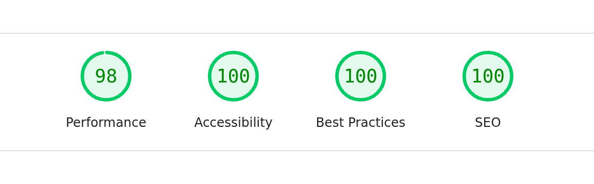

# 100% Lighthouse Scores: Automated Performance Audits in CI

Lighthouse is Google's open-source tool for auditing web page quality across four categories: performance, accessibility, best practices, and SEO. Most teams run it manually, glance at the scores, and move on. The scores slowly degrade. Nobody notices until a customer complains about load times or a screen reader user cannot navigate the app.

There is a better approach. Wire Lighthouse into your CI pipeline with thresholds the build enforces. Every commit gets audited. Accessibility and best-practices are pinned at a hard 100; performance gets a 0.95 floor that absorbs measurement jitter without letting a real regression through (the reasoning is below). A regression trips the gate immediately, while the change is fresh, instead of hiding for weeks until someone happens to run an audit by hand.

The challenge for a SaaS app is that most pages live behind authentication. Lighthouse cannot log in. You need a test server that automatically authenticates every request, seeds realistic data, and serves the same pages your real users see. This chapter shows how to build that in Clojure, configure Lighthouse CI, and hit perfect scores across the board.

There is one idea under everything that follows: a 100 is not an achievement, it is a *contract*. The point of the threshold is not the round number -- it is that the number turns every quality property Lighthouse can measure (a `lang` attribute, a meta description, sufficient contrast, a fast first paint) into a regression-guarded invariant instead of a thing someone has to remember. The individual fixes below each look small; what makes them matter is that, once passing, the gate keeps them passing. So read the list not as tips but as the set of audits we are choosing to pin, and the test server as the apparatus that lets us pin the authenticated ones too.



*The contract, made visible: the recipes page audited through the test server below, three categories at 100 and performance at 98, inside the 0.95 floor argued under `assert`.*

## The test server

The Lighthouse test server lives on the test classpath -- it is never compiled into the production jar. Its job is simple: start a real instance of the app with a middleware that auto-authenticates every request as a test user.

```clojure
(ns myapp.lighthouse
  "Lighthouse CI server entry point.
  Starts a clean app instance with auto-authentication for auditing
  both public and authenticated pages. Never shipped to production --
  lives on the test classpath only."
  (:require
    [myapp.analytics.db :as analytics]
    [myapp.config :as config]
    [myapp.db.core :as db]
    [myapp.time :as time]
    [myapp.web.assets :as assets]
    [myapp.web.routes :as routes]
    [org.httpkit.server :as http-kit]
    [reitit.ring :as ring]
    [ring.middleware.keyword-params :as keyword-params]
    [ring.middleware.params :as params]
    [ring.middleware.session :as session]
    [ring.middleware.session.cookie :as cookie])
  (:import
    [java.util UUID]))

(set! *warn-on-reflection* true)
```

The namespace requires the same modules as the real app: routes, database, assets, Ring middleware. It is the full application stack, not a mock.

### The auto-auth test user

Lighthouse needs to see authenticated pages, but it has no way to perform a login flow. The solution is a middleware that injects a session on every request:

```clojure
(defn- test-email
  "Email for the auto-authenticated Lighthouse test user.
  Read at runtime (not namespace-load time) so it always reflects the
  active config. Must match :admin-email so admin pages are accessible."
  []
  (config/get-config :admin-email))

(defn- wrap-auto-auth
  "Inject a session with the test user on every request.
  Lighthouse sees authenticated pages without needing cookies."
  [handler]
  (fn [request] (handler (assoc-in request [:session :user-email] (test-email)))))
```

The test email comes from the admin email in config, resolved at request time: a function, not a top-level `def`, so it tracks whatever profile the server starts under rather than freezing the value when the namespace loads (the same runtime-config discipline as [the web-server chapter](05-web-server.md)'s `delay` and [the email login-flow chapter](25-auth-email-flow.md)'s SMTP config). It also means the auto-authenticated user has admin privileges, so Lighthouse can audit admin pages too. `wrap-auto-auth` itself is trivial: one line of middleware that sets `:user-email` in the session map. The rest of the application sees a normal authenticated request.

This is convenient and dangerous in equal measure, so state the boundary plainly: **this server is an unauthenticated admin bypass by construction.** Anyone who can reach it is the admin -- no token, no login. That is fine for what it is (a throwaway instance the CI job starts, audits, and kills on loopback), but it must *never* bind a non-loopback interface or outlive the audit. It lives on the test classpath precisely so it cannot be reached from the production jar; keep it that way -- do not add it to a deployable alias, and bind it to `127.0.0.1`, never `0.0.0.0`.

### Seeding test data

An empty database produces empty pages. Empty pages get perfect performance scores but do not reflect what real users see. The test server seeds a user with accepted terms so the dashboard and other authenticated pages render with their full UI:

```clojure
(defn- seed-test-user!
  "Create a test user with terms accepted so dashboard renders fully."
  [conn]
  (let [now (time/now)]
    @(db/transact* conn
       [{:user/id (UUID/randomUUID)
         :user/email (test-email)
         :user/created-at now
         :user/active? true
         :user/terms-accepted-at now}])))
```

The `:user/terms-accepted-at` field is important. Without it, the app redirects to the terms acceptance page. With it, the dashboard renders normally. Seed the minimum data needed for pages to render their real content.

One honest limit of seeding the *minimum*: it proves the rendering path scores well, not that it stays fast at production data sizes. The dashboard here lists one user and a handful of links; in production those tables can run to the page's full limit. So the gate catches a regression in the markup, the critical CSS, or the font loading -- the things that are wrong at any size -- but it would not catch a layout that only janks once a table is long. If a page's cost scales with its rows, seed it near the realistic ceiling, not at one row, or the 100 is measuring the wrong page.

### Building the app

The test server reconstructs the Ring handler from the same route table the production app uses. The only difference is the middleware stack, which inserts `wrap-auto-auth` between session handling and the route handlers:

```clojure
(defn- build-app
  "Build the Ring handler with auto-auth in the middleware stack.
  Reconstructs the app from route data so auto-auth sits between
  session middleware (which reads cookies) and the handlers."
  []
  (let [session-store (cookie/cookie-store {:key (config/get-config :session-key)})]
    (ring/ring-handler
      ;; `:conflicts nil` mirrors prod — tolerates the static-vs-dynamic
      ;; overlap, matching conflicting routes in declaration order (so
      ;; `/recipes/new`, declared first, wins and other ids fall through).
      (ring/router routes/routes {:conflicts nil})
      (ring/routes
        (ring/create-file-handler
          {:path "/"
           :root assets/static-root})
        (ring/create-default-handler))
      {:middleware [[params/wrap-params] [keyword-params/wrap-keyword-params]
                    [session/wrap-session
                     {:store session-store
                      :cookie-attrs {:http-only true
                                     :same-site :lax}}]
                    [wrap-auto-auth] [routes/wrap-locale]
                    ;; Audit the page production actually ships, CSP header and
                    ;; all — the Lighthouse run would otherwise score a policy
                    ;; the real app never serves.
                    [routes/wrap-csp]]})))
```

The middleware ordering matters, and the position of `wrap-auto-auth` is forced. `wrap-params` and `wrap-keyword-params` run first to parse the request; `wrap-session` sets up cookie-based sessions. `wrap-auto-auth` must sit inside `wrap-session` because Ring's session middleware does not merge into a `:session` already on the request: on the way in it replaces the key wholesale with whatever the cookie store holds, an empty map here since Lighthouse sends no cookie. Inject the identity outside `wrap-session` and it is clobbered before any handler runs; inject it inside, and every handler sees a request identical to a real authenticated one. `wrap-locale` then determines the locale for i18n.

The stack ends with `wrap-csp`, and the comment above it is the argument: this server exists to audit the pages production actually ships, and [the asset-pipeline chapter](29-asset-pipeline.md)'s strict Content-Security-Policy is part of those pages. Leave it out and the run scores a response the real app never serves; the promise that this server serves the same pages your real users see is quietly false. Like the e2e server in [the e2e-testing chapter](27-e2e-testing.md), this one omits `:secure` -- the same plain-HTTP simplification, and for the same reason spelled out there (headless Chrome would in fact send it over `http://localhost`); the session cookie is `:same-site :lax`, which is all the auto-auth flow needs.

### The entry point

The `start!` function ties everything together. It creates fresh databases, loads the asset manifest (so `(assets/asset ...)` resolves the hashed URLs the views ask for), seeds the test user, and starts an HTTP server. It defaults to port 9876 -- the same port the e2e server in [the e2e-testing chapter](27-e2e-testing.md) uses; that is safe because the two run as separate, sequential CI steps and never bind the port at the same time:

```clojure
(defn start!
  "Start a Lighthouse audit server.
  Initializes a fresh database, seeds a test user, and starts http-kit.
  Prints a ready message that lhci startServerReadyPattern can match."
  [{:keys [port]
    :or {port 9876}}]
  (let [port (if (string? port) (parse-long port) port)]
    (db/create-database!)
    (analytics/create-database!)
    (assets/load-manifest!)
    (seed-test-user! (db/get-connection))
    (http-kit/run-server
      (build-app)
      {:port port
       :ip "127.0.0.1"})
    (println (str "Lighthouse server ready on port " port))
    @(promise)))
```

The final line -- `@(promise)` -- blocks the main thread indefinitely. Without it, the JVM would exit after starting the server. The `println` message is not decorative; Lighthouse CI uses it to know when the server is ready to accept requests, as we will see in the configuration below.

## Lighthouse CI configuration

With the test server in place, the Lighthouse CI configuration tells `lhci` how to start it, which URLs to audit, and what scores to enforce. Create a `lighthouserc.js` at the project root:

```javascript
module.exports = {
  ci: {
    collect: {
      startServerCommand: 'clojure -X:test myapp.lighthouse/start!',
      startServerReadyPattern: 'Lighthouse server ready on port',
      startServerReadyTimeout: 60000,
      url: [
        'http://localhost:9876/',
        'http://localhost:9876/recipes',
        'http://localhost:9876/terms/welcome',
        'http://localhost:9876/dashboard',
        'http://localhost:9876/admin',
      ],
      numberOfRuns: 1,
      settings: {
        chromeFlags: '--no-sandbox --headless --disable-dev-shm-usage --disable-gpu',
      },
    },
    assert: {
      assertions: {
        'categories:performance': ['error', {minScore: 0.95}],
        'categories:accessibility': ['error', {minScore: 1}],
        'categories:best-practices': ['error', {minScore: 1}],
        'categories:seo': ['warn', {minScore: 1}],
      },
    },
  },
};
```

The work happens in two blocks: `collect` starts the server and produces the audits, and `assert` turns each audit into a pass or a fail.

### `collect`

**`startServerCommand`** launches the Lighthouse test server using Clojure's `-X` (exec) flag. The `:test` alias adds the `test/` directory to the classpath, making `myapp.lighthouse` available. The function `start!` takes a map argument (the `-X` convention), so it receives `{}` by default and falls back to port 9876.

**`startServerReadyPattern`** is a string that `lhci` watches for in the server's stdout. When it sees `"Lighthouse server ready on port"`, it knows the server is accepting connections and begins the audit. This is why the `println` in `start!` matters -- it is a protocol between your server and the test runner.

**`startServerReadyTimeout`** gives the JVM 60 seconds to start. Clojure's startup is not instant, and the `:test` alias runs from source: every namespace is compiled as it loads, whereas the production jar ships classes compiled ahead of time. Sixty seconds is generous but avoids flaky failures in CI where CPU is constrained.

**`url`** lists every page to audit. This covers the full range: the public landing page (`/`), the recipe browse page (`/recipes`), the terms-acceptance flow (`/terms/welcome`), the authenticated dashboard, and the admin panel. Because `wrap-auto-auth` is active, Lighthouse accesses all of them without authentication ceremony. (Audit the routes your app actually serves -- pointing Lighthouse at a path with no route loads a 404 page, which will tank the very scores you are trying to enforce.)

**`numberOfRuns`** is set to 1. Lighthouse defaults to multiple runs and takes the median, which is useful for catching performance variance. For CI, a single run keeps the feedback loop fast; rather than spend that time re-running to median out the noise, we absorb that variance in the performance threshold instead (the 0.95 floor explained under `assert` below). If you would rather hold performance at a hard 100, raise `numberOfRuns` to 3 and take the median back.

**`chromeFlags`** configures headless Chrome for a CI environment. `--no-sandbox` is required in most Docker/CI environments where Chrome cannot create its sandbox; `--disable-dev-shm-usage` avoids shared-memory issues in containers with a small `/dev/shm`; `--headless` runs Chrome with no display, since CI has none; and `--disable-gpu` turns off GPU acceleration, which is absent (and only a source of noise) on a headless CI box.

### `assert`

The assertion block is where you set your standards. Each category maps to an assertion level and a minimum score:

- **Accessibility and Best Practices** are set to `error` with `minScore: 1` (100%). Any score below 100 fails the build. For a server-rendered app these are genuinely achievable, so we hold the line at perfect.
- **Performance** is set to `error` with `minScore: 0.95`. Performance is the one category Lighthouse scores from continuous metrics -- largest contentful paint, total blocking time, layout shift -- measured under simulated CPU and network throttling, so its score carries genuine run-to-run variance: CI CPU contention and lab-throttling jitter move it by a few points on an unchanged page. That makes a *repeatable* 100 unrealistic. A 100 is achievable and is the ceiling we engineer toward, but it is not a number we can guarantee on every run -- so the contract is the floor, not the round number. A 0.95 floor fails a genuine regression while absorbing the jitter, and a representative run landing at 98 is exactly that jitter, not a defect. The deterministic categories above have no such noise, which is why we can pin *them* at a hard 100 and only give performance a floor.
- **SEO** is set to `warn` with `minScore: 1`. It warns rather than errors because some SEO checks (like canonical URLs or structured data) may not apply to authenticated pages. The warning keeps it visible without blocking deploys.

## Running it

There is no wrapper script to write -- the whole audit is one command, run from the project root (where `lighthouserc.js` lives):

```bash
lhci autorun
```

`lhci autorun` handles everything: it starts your server (using `startServerCommand`), waits for the ready pattern, runs Lighthouse against each URL, collects the reports, and checks the assertions. If any assertion fails, it exits non-zero, which fails your CI step. This is exactly the command [the CI/CD chapter](34-ci-cd.md) wires into the pipeline -- no bespoke script in between. (If you prefer a short alias, a one-line `lhci autorun` wrapper is fine, but the companion repo deliberately keeps the canonical command in the workflow rather than hiding it behind a script.)

## Hitting 100%

Setting the thresholds is easy. The first time you point `lhci autorun` at an untreated server-rendered app, it fails -- and it fails in the same four predictable places every time, because they are exactly the things a from-scratch HTML app forgets. The useful way to learn them is the way the tool teaches them: run it, read the audit it docked you on, understand *why* it checks that, fix it, and run again to watch the number move. We will walk those four failures in roughly the order the report surfaces them, from the cheapest accessibility miss to the one that has to be designed in.

### The missing `lang`, viewport, and description

Run the audit cold and the first things to fall are accessibility, SEO, and best practices, all on small omissions in the document head -- but on *different* omissions, which is worth keeping straight. Accessibility and SEO fall on a missing `lang` on `<html>`, viewport meta, and description; best practices falls separately on a missing doctype and charset. Lighthouse checks these because they are not cosmetic -- `lang` is what tells a screen reader which language to pronounce and a search engine which language to index, the viewport tag is what makes the page render at device width instead of zoomed-out desktop, the description is what a result snippet is built from, and the doctype plus `<meta charset>` are what keep the browser out of quirks mode and its byte-level encoding unambiguous. In Hiccup, the base layout fixes all of them in one place:

```clojure
(defn- base-layout
  [locale & body]
  (h/html
    {:mode :html}
    (h/raw "<!DOCTYPE html>")
    [:html {:lang (name locale)}
     [:head [:meta {:charset "UTF-8"}]
      [:meta
       {:name "viewport"
        :content "width=device-width, initial-scale=1.0"}]
      [:meta
       {:name "description"
        :content (t locale :meta/description)}]
      ;; ...
      ]]))
```

This is the same escaping `h/html` layout from [the Hiccup views chapter](14-hiccup-views.md) -- not `hiccup.page/html5`, which we dropped there because it does not escape string content. Because these live in the shared base layout, every page gets them automatically, and a new page can never ship missing them. Re-run, and accessibility, SEO, and best practices all jump -- which surfaces the next failure, this one on performance.

### Font display

The performance audit docks you on "Ensure text remains visible during webfont load," and the cause is the custom font: by default the browser blocks text rendering until the font downloads, so the user stares at a blank page (a flash of invisible text). The fix is one line -- `font-display: swap` in the `@font-face` declaration:

```css
@font-face {
  font-family: "Geist";
  src: url("/fonts/GeistVF.woff2") format("woff2");
  font-weight: 100 900;
  font-style: normal;
  font-display: swap;
}
```

With `swap`, the browser immediately renders text in a fallback font, then swaps in the custom font when it finishes loading. Users see content instantly. Lighthouse gives you full marks on the "Ensure text remains visible during webfont load" audit.

`swap` is the right default here, but it is a choice with a cost worth naming. Its swap period is unlimited, so a slow font load shows the fallback for a while and then *swaps* -- and if the fallback and the final font have different metrics, that swap is a late layout shift that can *hurt* the CLS score this same performance audit rewards. The stricter alternative, `font-display: optional`, gives the font one brief window to arrive and otherwise keeps the fallback for the life of the page: zero layout shift, at the price of sometimes not showing your font at all on a slow connection. We take `swap` because the fallback stack is metric-close and the brand font is worth showing; a page whose score lives or dies on CLS would reasonably choose `optional`. That is the actual decision behind the one-line fix.

Using a variable font (the `VF` in `GeistVF.woff2`) also helps performance. Instead of loading separate files for each weight (regular, bold, semibold), a single variable font file covers the entire `100 900` weight range. Fewer network requests, smaller total download.

### Semantic HTML

With the head and the font handled, the accessibility audit's remaining deductions are structural -- and they only show up once you have real pages, because they are about the *shape* of the markup, not a tag in the head. A `<div>`-soup app fails them. The three the gate actually scores here:

- Proper heading hierarchy (`<h1>`, `<h2>`, etc.) without skipping levels -- the `heading-order` audit.
- `<label>` elements associated with form inputs via the `for` attribute -- the `label` audit.
- An accessible name on every link and button, even when the visible text is gone -- the `link-name` and `button-name` audits. The nav tabs hide their text below the `sm` breakpoint, leaving icon-only links, so each carries an `aria-label`.

And one caveat, stated honestly: use `<main>` for the primary content area and `<nav>` for navigation, but know that the gate does not hold you to it. In the Lighthouse this repo runs (12.x, bundled with `@lhci/cli`), the `<main>`-landmark audit (`landmark-one-main`) carries weight 0 and is hidden from the report, the general landmarks check is a weight-0 manual audit, and no scored audit looks for `<nav>` at all -- a page missing both still scores a clean 1.0, and the `minScore: 1` gate passes it untouched. We keep the landmarks anyway, partly because assistive technology navigates by them whether or not Lighthouse grades them, and partly because in this app `<main>` is enforced by something stricter than any audit: it is the morph target the dispatcher extracts on every navigation ([the morph-dispatcher chapter](15-morph-dispatcher.md)). Drop it and every page breaks, not just a score.

> **An accessibility 100 is a floor, not a certificate.** The weight-0 landmark audit is one case of a general limit worth stating plainly: an automated audit reaches only a fraction of the WCAG criteria -- common estimates put it between a third and half -- because a machine can confirm that a label or an `alt` is *present* but not that it is *meaningful*, and it cannot judge reading order, keyboard traps, focus management, or whether the page makes sense to someone who cannot see it. So the 100 we pin is the necessary, regression-proof baseline, every mechanical miss caught the moment it ships -- not a claim that the app is accessible, which only a person with a screen reader and a keyboard can tell you.

In the app layout, this looks like:

```clojure
(defn app-layout
  [locale user-email active-tab opts & body]
  (let [admin? (:admin? opts)]
    (base-layout
      locale
      [:div.min-h-screen.flex.flex-col.bg-surface-subtle
       (top-nav locale user-email active-tab admin?)   ;; renders the <nav>
       [:main.flex-1 {:data-layout "app"}              ;; the single <main>
        [:div.mx-auto.max-w-5xl.px-4.py-8.sm:px-6
         body]]])))
```

And forms use explicit label associations:

```clojure
[:label.block.text-sm.font-medium.text-text-primary {:for "email"}
 (t locale :home/email-label)]
[:input ;; ...styling classes elided
 {:type "email" :id "email" :name "email" :required true
  :placeholder (t locale :home/email-placeholder)}]
```

These are not difficult changes, but they are easy to forget -- and for the scored ones, Lighthouse in CI catches the omission before it ships; `<main>` rides on the dispatcher's stricter guarantee instead. Re-run, and one last class of failure stands between accessibility and 100: the only one you cannot retrofit with markup.

### Color contrast

The final accessibility deductions are contrast failures: text that does not stand out enough against its background to clear WCAG 2.1's ratios. This one is different from the others -- there is no tag to add, because the fix is in the palette itself, which means it has to be designed in from the start rather than patched at the end.

In the CSS theme definition (`input.css`), the four values contrast hangs on:

```css
@theme {
  /* ... */
  --color-surface: #ffffff;
  --color-surface-subtle: #fafaf9;
  /* ... */
  --color-text-primary: #0f172a;    /* near-black: 17.1:1 even on the subtle surface */
  --color-text-secondary: #78716c;  /* warm stone gray: 4.6:1, the tight one (below) */
  /* ... */
}
```

The minimum ratio for normal text is 4.5:1 (the AA standard); for large text it is 3:1. The tightest pair in this palette is `text-secondary` on the app shell's `surface-subtle` background: `#78716c` on `#fafaf9` computes to 4.59:1, clearing AA by less than a tenth of a point. On the white card surface the same gray reaches 4.8:1; it is the tinted background that eats the margin. Pick a slightly lighter gray, or a slightly darker background tint, and Lighthouse catches it.

The lesson: pick your grays carefully, and let Lighthouse verify the math. Eyeballing contrast is unreliable.

With those four classes of failure closed -- the head, the font, the markup structure, the palette -- the cold run that started red comes back green across all five URLs. The point of walking them in order is not the list itself but the loop: every score Lighthouse reports traces to a specific audit with a specific reason, and the way you get to 100 is to read the deduction, not to memorize a checklist. Which is exactly why the next step is to make that loop run on every push.

## How it fits in CI

The Lighthouse audit runs alongside the other verification scripts:

| Command | What it checks |
|---|---|
| `./reformat` | Code formatting (zprint) |
| `./lint` | Static analysis (clj-kondo) + the "read time only through `myapp.time`" guard |
| `clojure -X:test` | Unit + integration tests (in-memory Datomic) |
| `npx playwright test` | Playwright end-to-end tests (auto-starts the e2e server) |
| `lhci autorun` | Lighthouse performance/accessibility/SEO audit |

`reformat` and `lint` are the two committed convenience scripts; the rest are plain one-liners the workflow calls directly. All five must pass before merging to main. The CI pipeline runs them in sequence. If Lighthouse fails, you know the exact commit that introduced the regression, and the Lighthouse report tells you exactly which audit failed and why.

## Where this leaves us

The apparatus is two files. One Clojure namespace on the test classpath boots the real application behind `wrap-auto-auth` and seeds just enough data for pages to render their true content rather than empty shells; one `lighthouserc.js` audits five real URLs and holds accessibility and best-practices at 100, with a 0.95 performance floor for measurement noise. The fixes that get there -- the head metadata, `font-display: swap`, the heading and labeling structure, the contrast-checked palette -- live in the shared layout and the theme, so they apply to every page at once and a new page cannot quietly drop one.

The total cost is those two files; there is no wrapper script, because `lhci autorun` is the whole command. The ongoing cost is zero -- Lighthouse runs on every commit -- and the value is that performance, accessibility, and SEO regressions are caught the moment they are introduced, not weeks later when someone happens to run an audit by hand. That is the contract the chapter opened with: the 100 is not a trophy you won once, it is an invariant the gate keeps true on every push.
