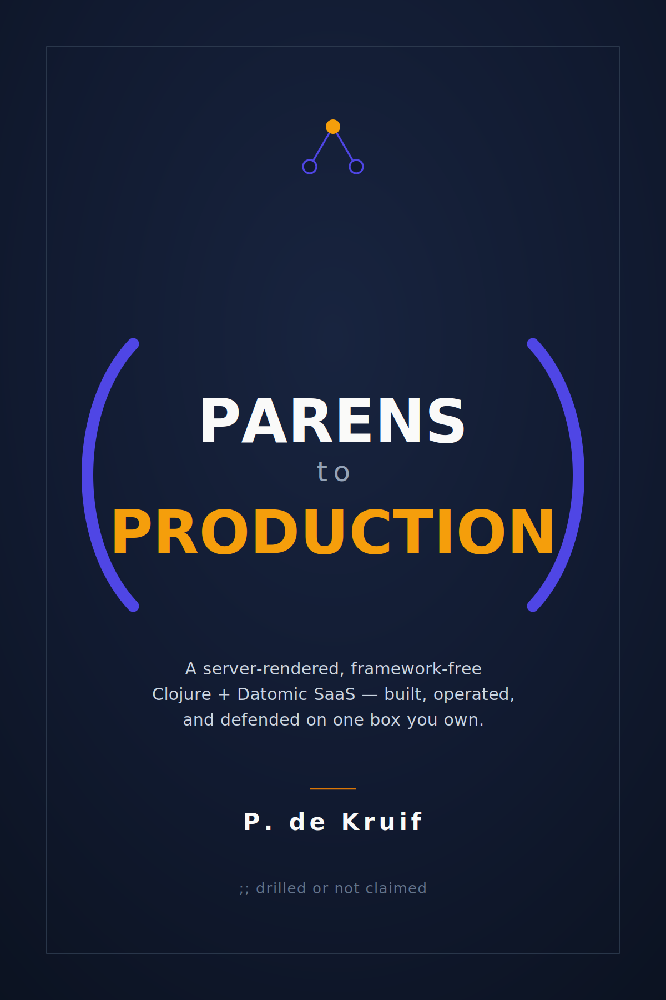

<div style="text-align: center; margin: 1rem 0 2.5rem;">
  
</div>

# Parens to Production

**A server-rendered, framework-free Clojure/Datomic SaaS -- built, operated, and defended on one box you own.**

A hands-on, chapter-by-chapter guide to building a production-grade SaaS
application in Clojure and Datomic. From a reproducible development
environment through automated CI/CD deployment to operating, defending, and
running the box for the long run.

Each chapter is self-contained but builds on the last. Use the sidebar to
navigate, or the arrow keys to move between chapters. Press **`s`** or click
the magnifier to search the full text.

## What's covered

- A reproducible **devcontainer** dev environment (Docker, Caddy, Mailpit, TLS)
- **Strict compilation** to catch reflection and boxed math early
- A **web server** with Ring, http-kit, and Reitit
- **Live reload**, **DOM-morphing hot reload**, and a **Hiccup source inspector**
- A ClojureStorm-powered **construction view**: one request's full execution,
  recorded and projected onto the page it rendered
- **Datomic** schema and queries, **i18n**, and **Tailwind** styling
- **Recipe versioning** -- versions, diffs, and forks read straight from
  Datomic's history, with **provenance** on the transactions themselves
- **Server-rendered views** with Hiccup, a **morph dispatcher** for in-place
  navigation, and **progressive enhancement** from SSR to islands
- **Validated forms** that re-render with their errors, a **live preview**
  through speculative `d/with`, **full-text search**, and an **activity feed**
  from the transaction log
- **E2E testing** with Playwright
- **Passwordless auth** with single-use, HMAC-signed magic links
- **Machine legibility** (Open Graph, schema.org, a database-backed sitemap)
  and **conditional GET** validated by Datomic's basis-t
- The server path **measured** with criterium and a flamegraph
- An **admin dashboard**, a hardened **asset pipeline** (hashing, SRI, CSP),
  **Lighthouse** audits, and **CI/CD** with a softened deploy window
- **Going live** -- PostgreSQL + the Datomic transactor, systemd units,
  automatic TLS -- and **minimal-downtime updates** with a verified
  two-instance handoff
- **Operating**: a hand-rolled **metrics** endpoint (with the peer's own
  telemetry), **alerting** from systemd + SMTP, **backup/restore drilled**
  with history intact, **excision** run for the right to be forgotten, and
  an honest **scaling audit**
- **Defending**: a security-event trail feeding **fail2ban**, live
  containment levers (ban an IP/user, rotate a key with a grace window), a
  default-deny **nftables** firewall, a real **CVE gate**, and a 3am
  **runbook**
- **Collaboration**: a fork's changes **proposed back** and resolved by a
  **three-way merge** (the common ancestor is a read), and **real-time
  viewer presence** over Server-Sent Events -- SSR is not the opposite of live
- **The Long Run**: the safety machinery **watching itself** (the guard
  nothing watched), a durable **job queue** whose storage is Datomic rather
  than a broker, **keyset pagination** that seeks the index the schema
  already carries, and a **content-addressed photo store** on the box's own
  disk -- bytes on disk, metadata in Datomic, no bucket required

## Reading this both ways

The prose and the application are one repository, and the book was written to
be read alongside a running copy of what it describes. Two chapters in, that
invitation should be concrete, so here is the whole on-ramp:

```bash
git clone https://github.com/mapidentity/parens-to-production
code parens-to-production             # open in VS Code, then "Reopen in Container"
# ...the devcontainer builds once (JDK, Node, Caddy, Mailpit, TLS certs), then
# start a REPL and bring the system up:
clj -M:dev:repl                       # an nREPL your editor connects to
(start!)                              # server + file watcher, listening on :3000
```

Then open the app: in the in-container browser it is `https://myapp.lan`, the
full TLS front door the app's own URLs are built around; from your own machine
it is the editor's forwarded `http://localhost:3000`. That is the entire setup,
and [the devcontainer chapter](03-devcontainer.md) is the one that earns it:
everything above is checked in, so a fresh clone runs the same on every machine.
You do not need to master that chapter to use its result -- open the container,
start the REPL, and you have the live system this book takes apart. Read a
chapter, then go change the thing it just built and watch what moves.

One honest note on prerequisites, so the early chapters do not ambush you. The
book assumes you can read Clojure and are at home with the infrastructure an
application sits on -- containers, TLS, a reverse proxy -- which it treats as
tools you already own rather than topics it teaches. If Docker or a devcontainer
is new to you, spend an hour with the [VS Code dev containers
guide](https://code.visualstudio.com/docs/devcontainers/containers) first; it
will pay for itself by [chapter 3](03-devcontainer.md), the densest
infrastructure stretch in the first half. The [primer](01-primer.md) names the
steep chapters and how to read them.

Start with [the primer](01-primer.md) for what we are building and why, or jump
to any topic from the table of contents.
